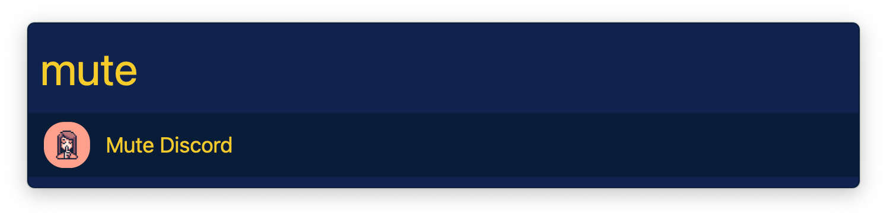

## Usage

Mute and unmute discord without having to give it Input Monitoring permissions via the `mute` keyword. Discord will be brought to the front, muted, then switched to the previous app.

Configure the Hotkey for faster triggering.
