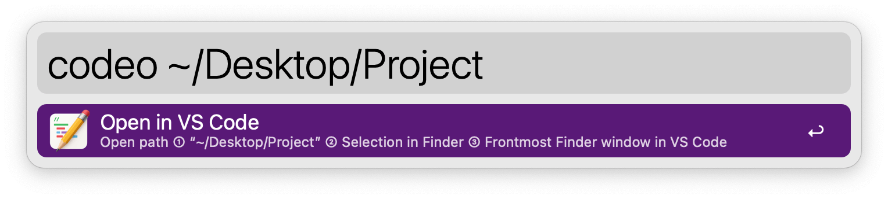
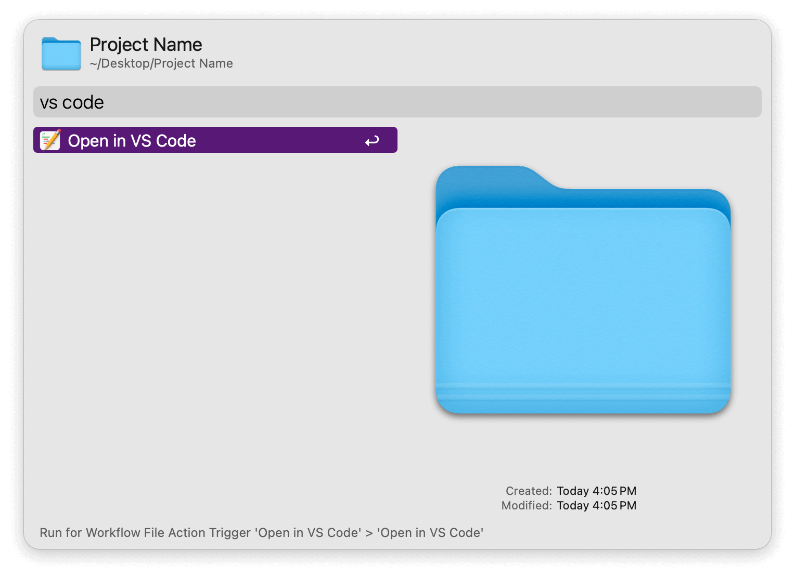
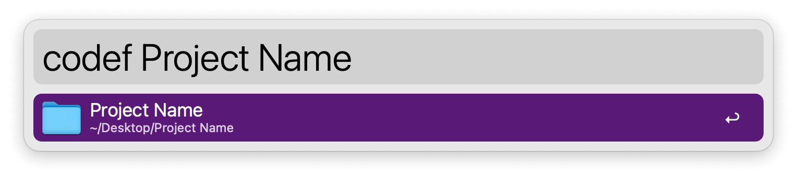

## Usage

Open files, folders in VS Code, VSCodium or Cursor via the `codeo` keyword.

Leave the argument empty to open current selection or, if no selection, frontmost folder in Finder.

Alternatively, open any selected file or folder via the Universal Action.

Search for files or folders to open via the `codef` keyword.

