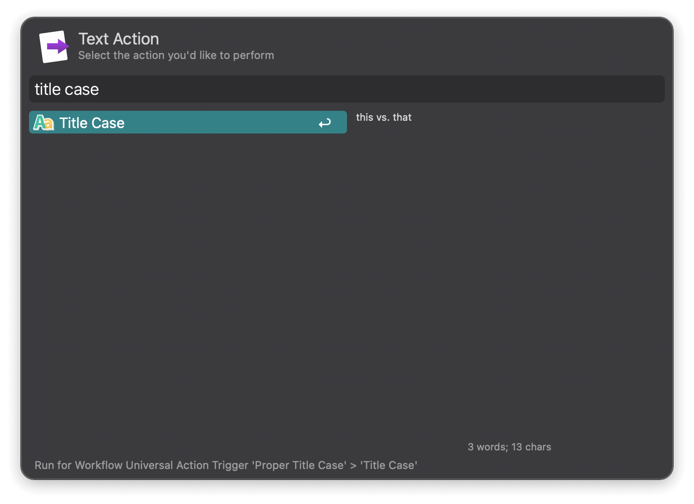

## Usage

Convert text to title case via the `titlecase` keyword.

* <kbd>↩︎</kbd> Convert text and copy to clipboard.

Leave the argument empty to convert clipboard content.

Alternatively, convert selected text via the Universal Action.

