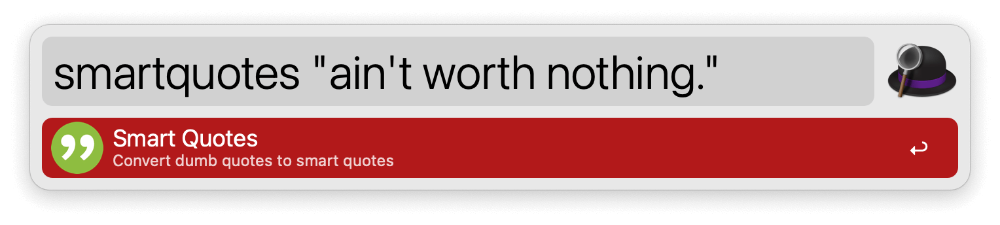
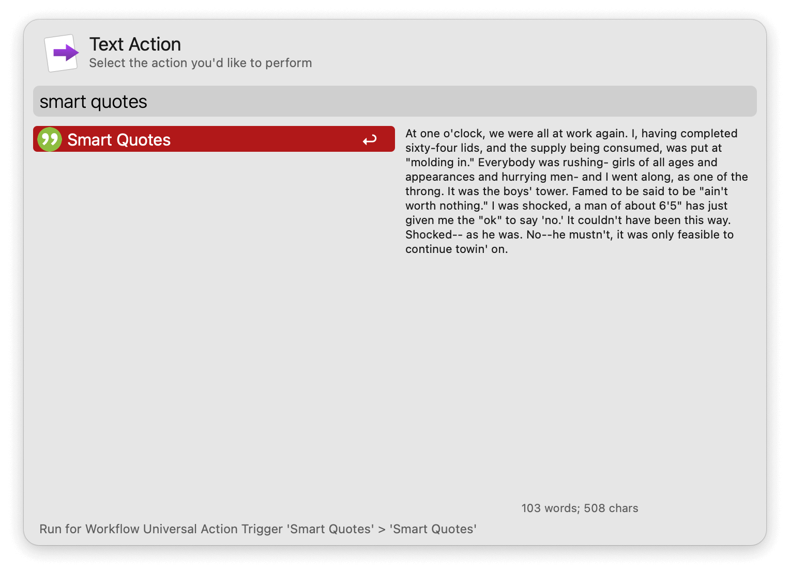

## Usage

Convert straight quotes into smart quotes via the `smartquotes` keyword.

* <kbd>↩︎</kbd> Convert text and copy to clipboard.

Leave the argument empty to convert clipboard content.

Alternatively, convert selected text via the Universal Action.

