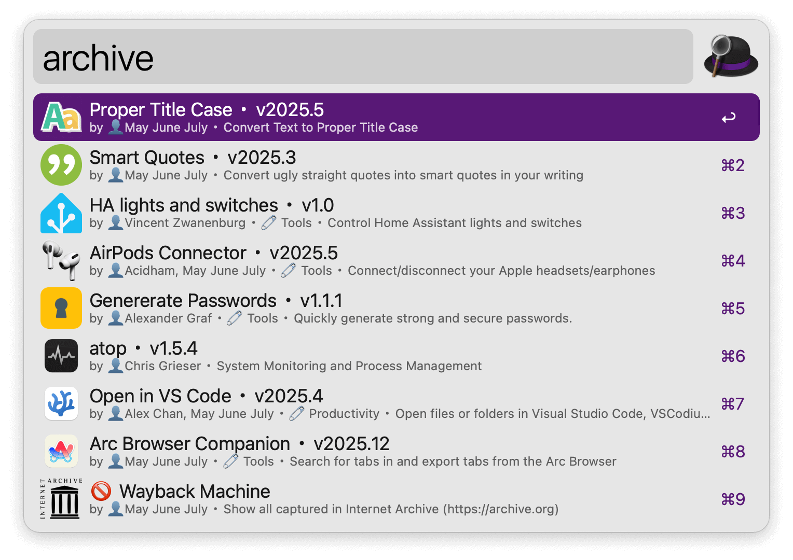
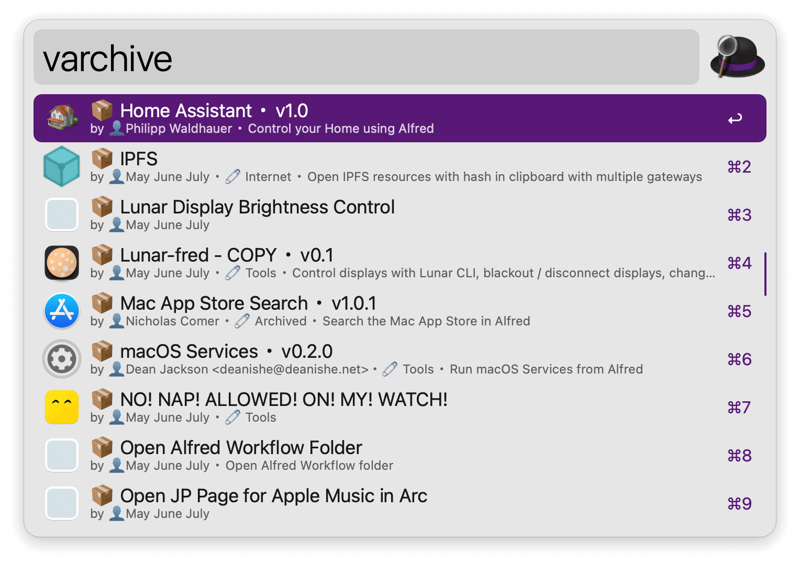

## Usage

Archive workflows via the `archive` keyword.

* <kbd>↩</kbd> Edit workflow in Alfred.
* <kbd>⌘</kbd><kbd>↩</kbd> Archive workflow.

View archived workflows via the `varchive` keyword.

* <kbd>↩</kbd> Recover workflow.
* <kbd>⌘</kbd><kbd>↩</kbd> Trash workflow.
