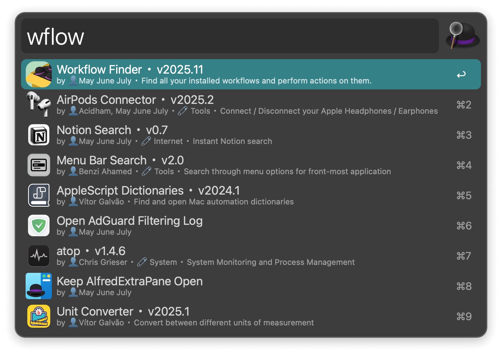
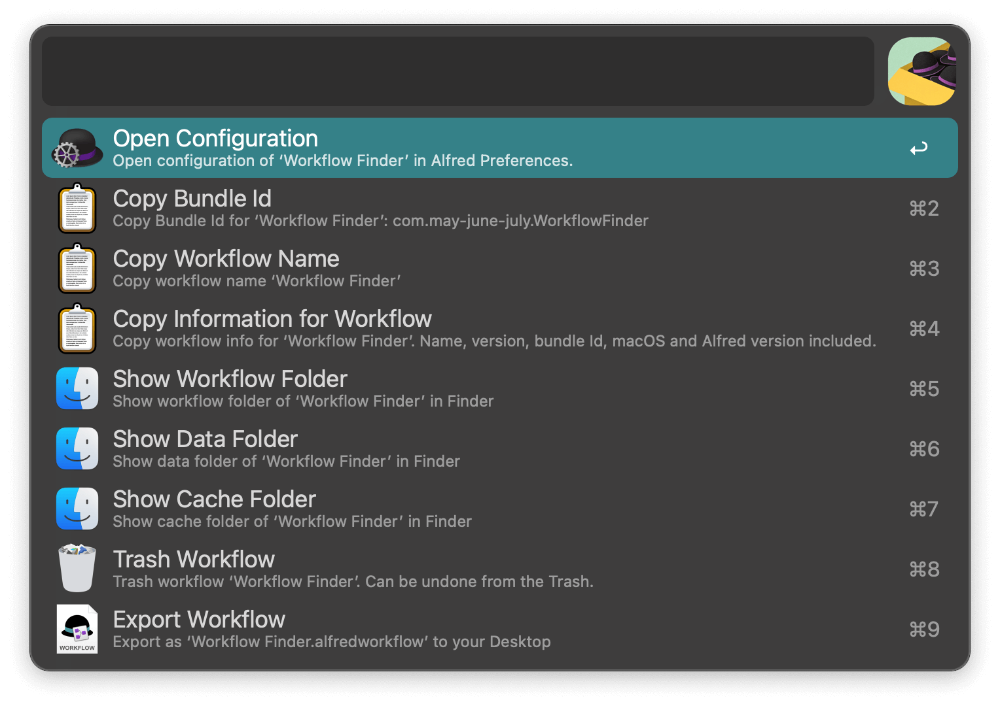

## Usage

Search your installed workflows via the `wflow` keyword.

* <kbd>↩</kbd> Edit in Alfred.
* <kbd>⌘</kbd><kbd>↩</kbd> Open the configuration page. 
* <kbd>⌘</kbd><kbd>⇧</kbd><kbd>↩</kbd> Copy the bundle ID.
* <kbd>⇧</kbd><kbd>↩</kbd> Open the workflow folder.
* <kbd>⌃</kbd><kbd>↩</kbd> Open the data folder.
* <kbd>⌥</kbd><kbd>⌃</kbd><kbd>↩</kbd> Open the cache folder.
* <kbd>⇧</kbd><kbd>⌃</kbd><kbd>↩</kbd> Trash the workflow.
* <kbd>⌥</kbd><kbd>⇧</kbd><kbd>⌘</kbd><kbd>↩</kbd> Copy workflow info.
* <kbd>⌥</kbd><kbd>↩</kbd> Show all actions. 

