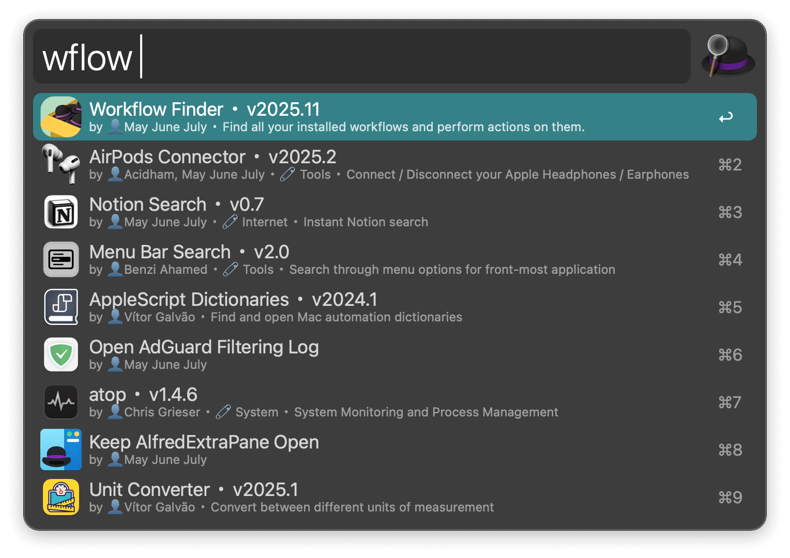
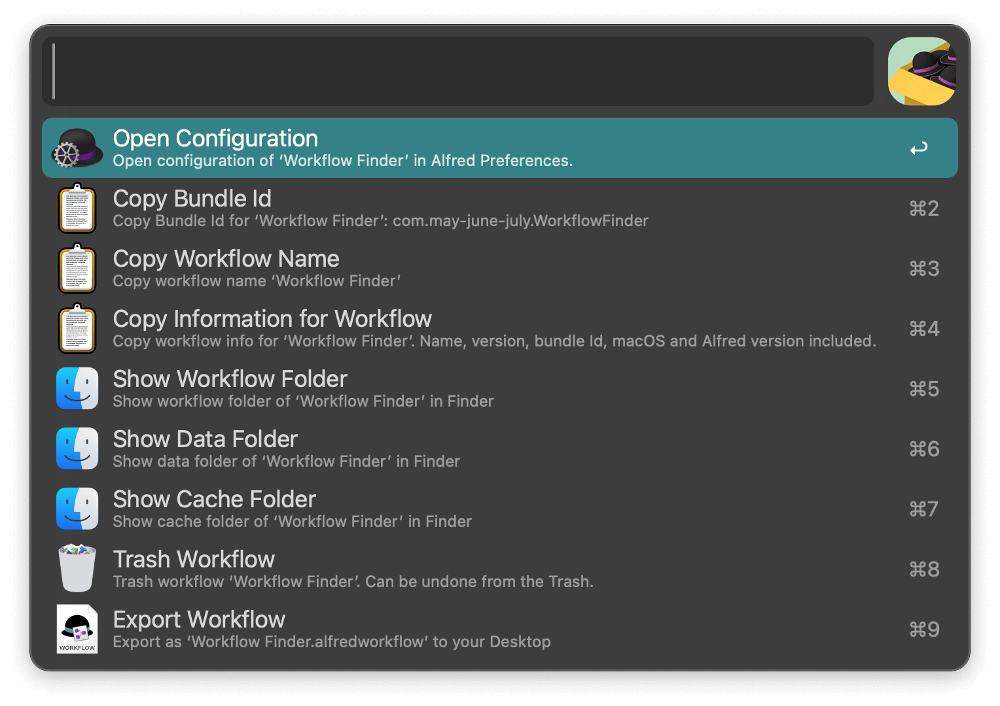

## Usage

Search your installed workflows via the `wflow` keyword.

* <kbd>↩</kbd> Edit in Alfred.
* <kbd>⌘</kbd><kbd>↩</kbd> Open the configuration page.
* <kbd>⇧</kbd><kbd>↩</kbd> Open the workflow folder.
* <kbd>⌃</kbd><kbd>↩</kbd> Trash the workflow.
* <kbd>⌥</kbd><kbd>↩</kbd> Show all actions.

Change default modifier keys for actions in the Workflow’s Configuration.
