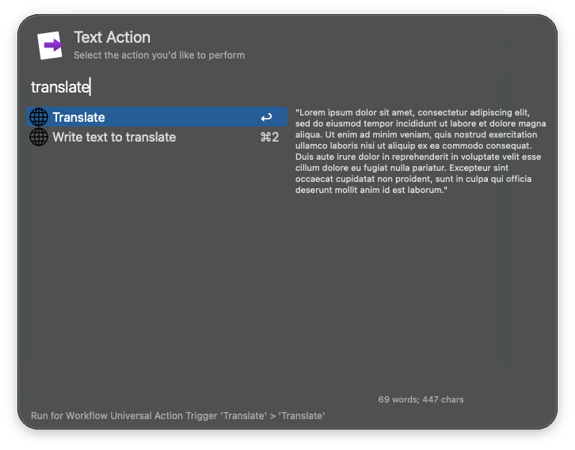

## Setup

Set the secondary and output languages in the Workflow’s Configuration.

## Usage

Translate words or sentences to another language via the `translate` keyword.

* <kbd>↩</kbd> Copy the translated text to the clipboard.
* <kbd>⇧</kbd><kbd>↩</kbd> Paste the translated text to the frontmost app.
* <kbd>⌥</kbd><kbd>↩</kbd> Show the translated text in the Text View.

Alternatively, begin translation with the Universal Actions.

Configure the Hotkey for faster triggering.
