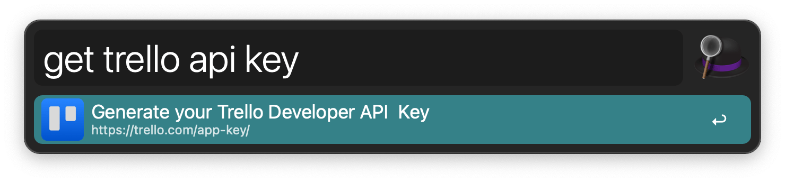
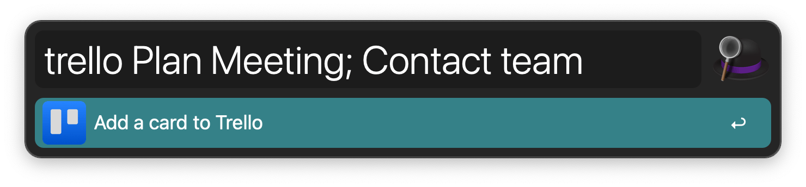

## Setup

Log in to [Trello](https://trello.com/) in your default web browser.

Open the page to create a new API key with `get trello api key`.

You’ll need to create a new integration but don’t worry too much about the details since it’s only for yourself. Then grab your API key and set it in the Workflow’s Configuration.

Open the page to create a new token with `get trello token`.

Authorise your integration, then grab the token and add it to the Workflow’s Configuration.

Finally, get the ID of the board you want to add cards to. You can do so by looking at the URL in your browser and extracting the string after `/b/`. So if your board is located at `https://trello.com/b/nC8QJJoZ/trello-development-roadmap`, the ID is `nC8QJJoZ`. Add it to the Workflow’s Configuration.

You can further configure the workflow by setting up the default list to add to, default labels, and more.

## Usage

Add new cards to a Trello list via the `trello` keyword.

The above example would create a card named `Plan Meeting` with the description `Contact team`. You can add much more infomartion to each card, separated by semicolons. The order of fields is set in the Workflow’s Configuration.
