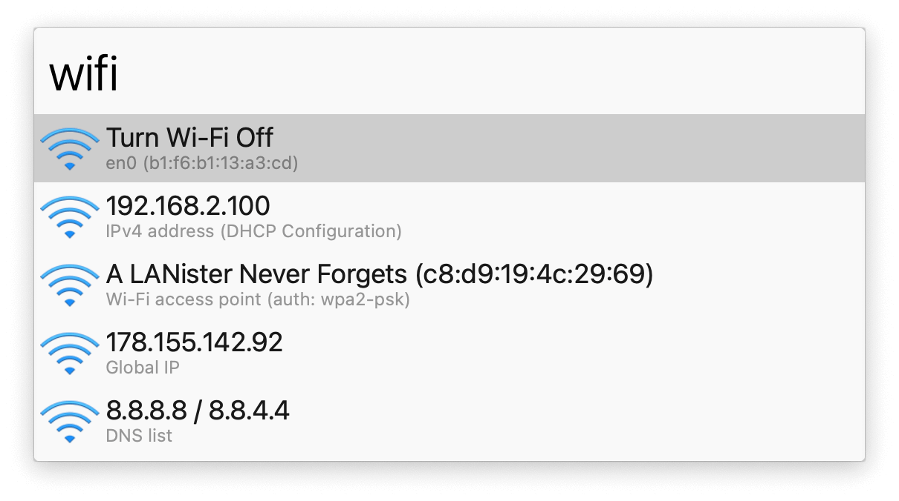
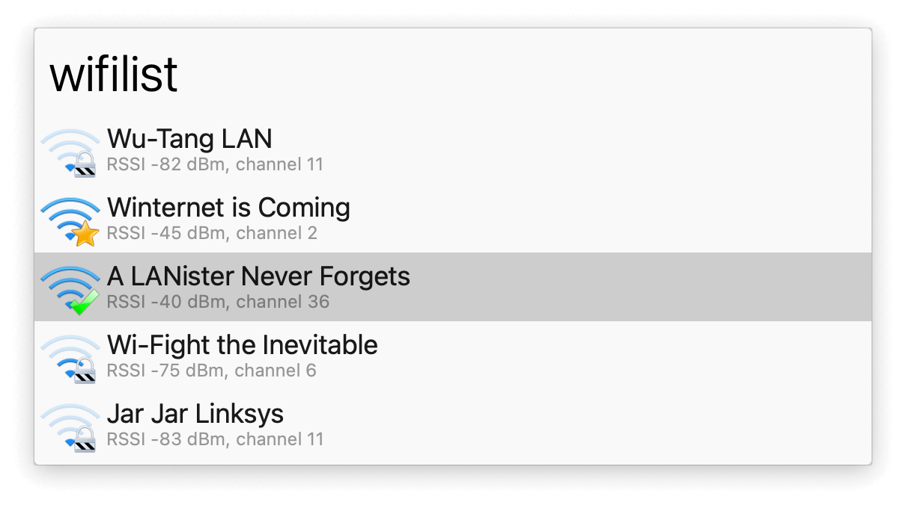

## Usage

Show and change network settings for Wi-Fi, Ethernet, VPN, and DNS, via the workflow’s keywords:

* `wifi` Show Wi-Fi info and enable/disable.
* `eth` Show ethernet info (if connected).
* `wifilist` Scan for Wi-Fi hotspots.
* `vpn` List configured VPNs and connect.
* `dns` List and change DNS settings.

