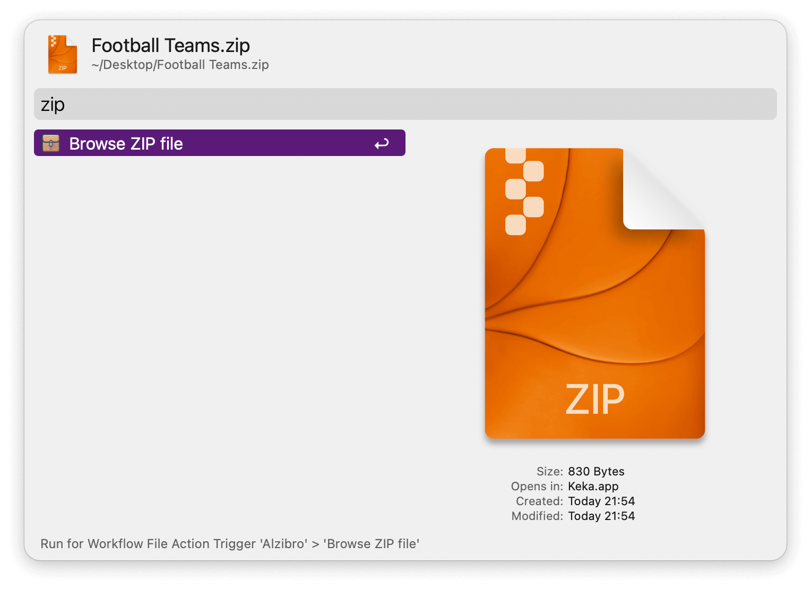
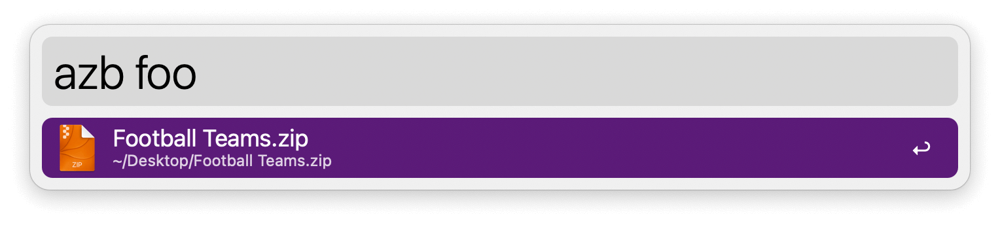
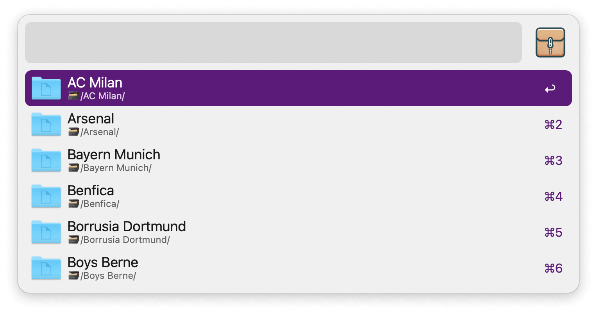

## Usage

Browse a ZIP file without fully opening it via the Universal Action.

Alternatively, search ZIP files with the `azb` keyword.

* <kbd>↩</kbd> Navigate inside folder.
* <kbd>⇧</kbd><kbd>↩</kbd> Navigate upwards in the hierarchy.
* <kbd>⌘</kbd><kbd>↩</kbd> Unzip selected file or folder.
* <kbd>⌃</kbd><kbd>↩</kbd> Quick Look a file.
