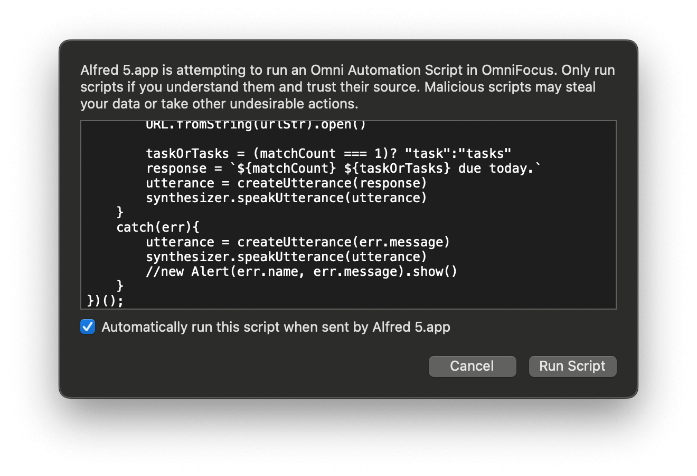
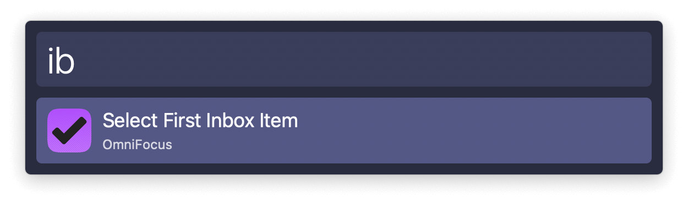
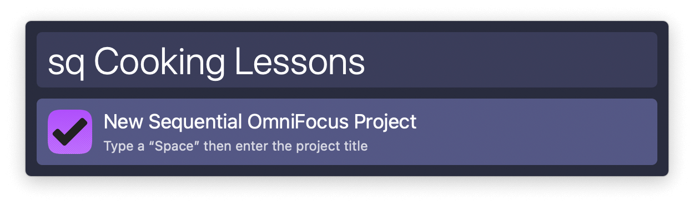
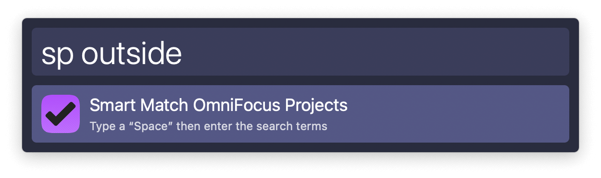
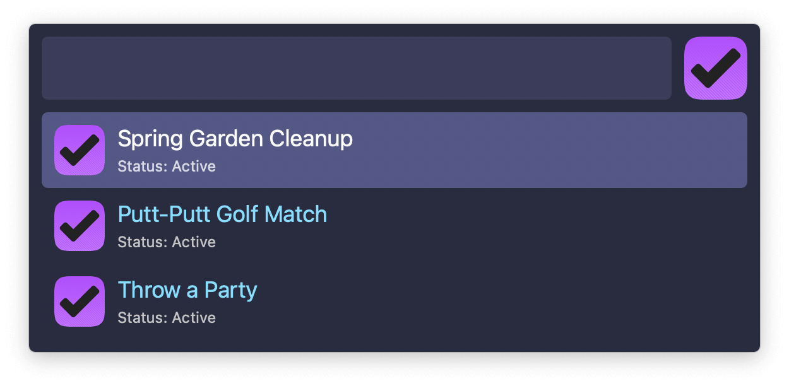
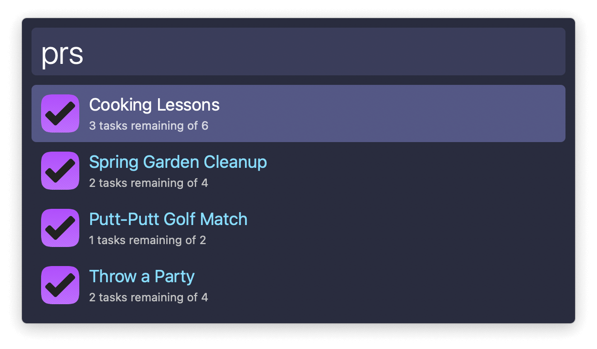
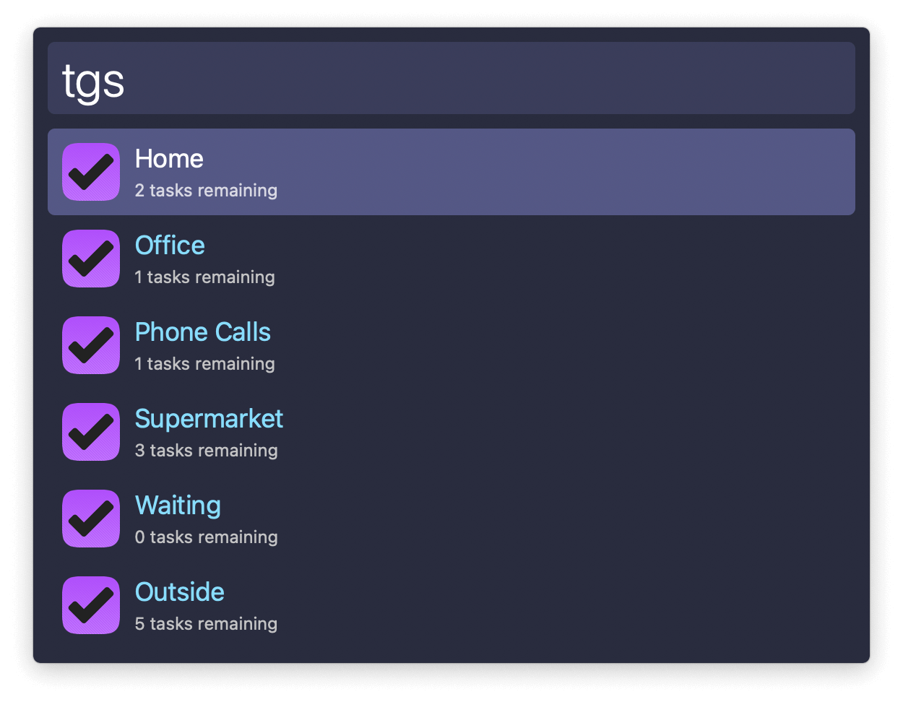
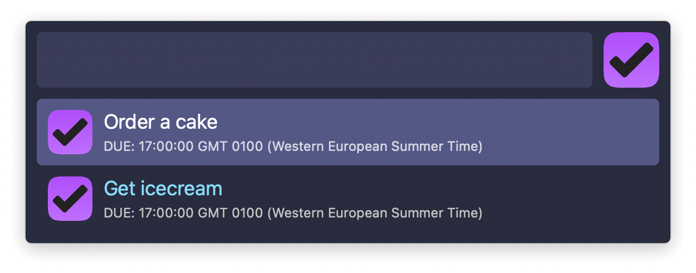

## Setup

During the initial run of some actions, OmniFocus will ask you to confirm you want to run the code.

## Usage

Highlight the top inbox item in OmniFocus via the `ib` keyword.

Create a new sequential project with `sq` followed by its name.

Projects can be searched with either the `sp` or `prs` keywords. `sp` does a smart search across several item details and returns a list which you can filter further.

The `prs` keyword shows all projects with the remaining and total number of tasks. Type to filter them by title.

In both cases, pressing <kbd>↩</kbd> opens OmniFocus on the selected project.

Search tags via the `tgs` keyword. <kbd>↩</kbd> to show in OmniFocus.

Finally, list all tasks due today with `tsk`.

All keywords are editable in the Workflow’s Configuration.
