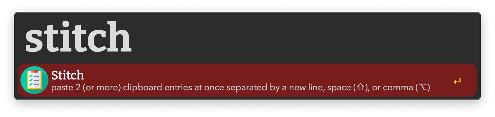
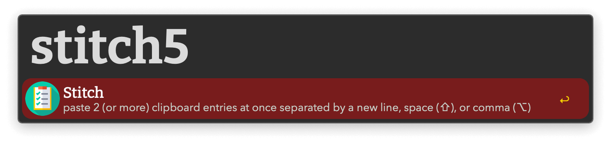

## Usage

Paste multiple entries from your Clipboard History at once via the `stitch` keyword.

* <kbd>↩</kbd> Paste items separated by newlines.
* <kbd>⌥</kbd><kbd>↩</kbd> Paste separated with commas.
* <kbd>⇧</kbd><kbd>↩</kbd> Paste separated with spaces.

By default the most recent two entries are used. Increase the number of items up to 6 by appending a number to the keyword without a space.

