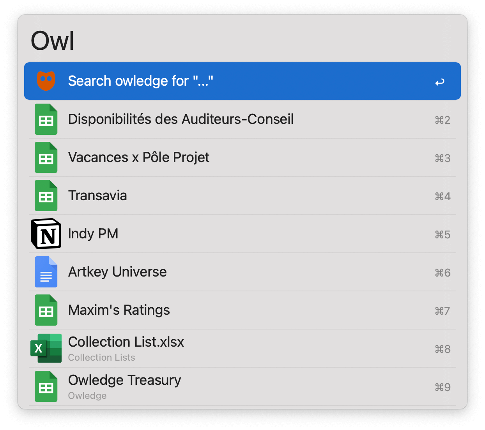
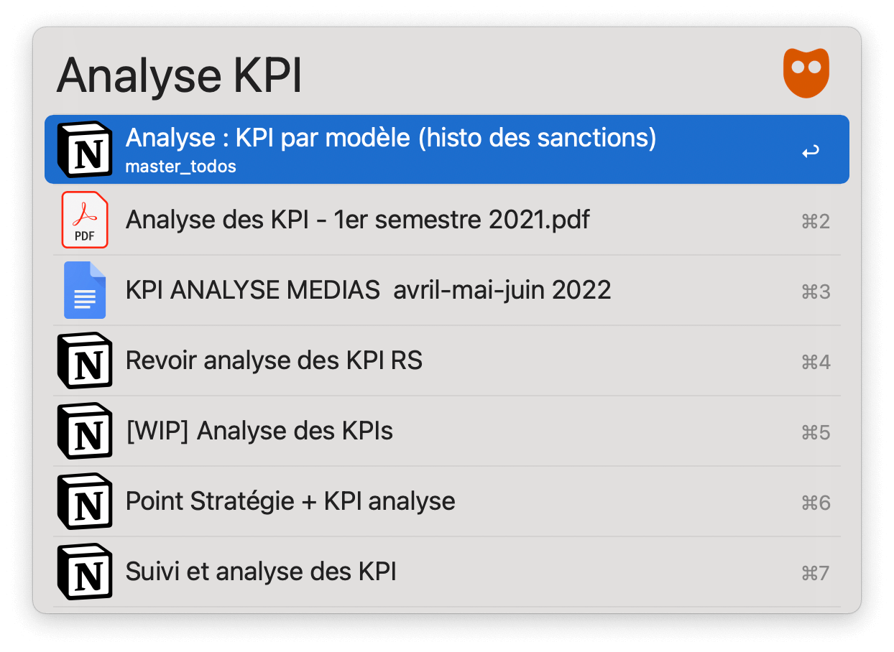

## Setup

Add [your workspace ID and API key](https://owledge.notion.site/Use-Alfred-s-workflow-c93bad7b9ccb495c8dbbfa2656eb257d) to the Workflow’s Configuration.

## Usage

Search your tools with [Owledge](https://owledge.app) via the `owl` keyword.

