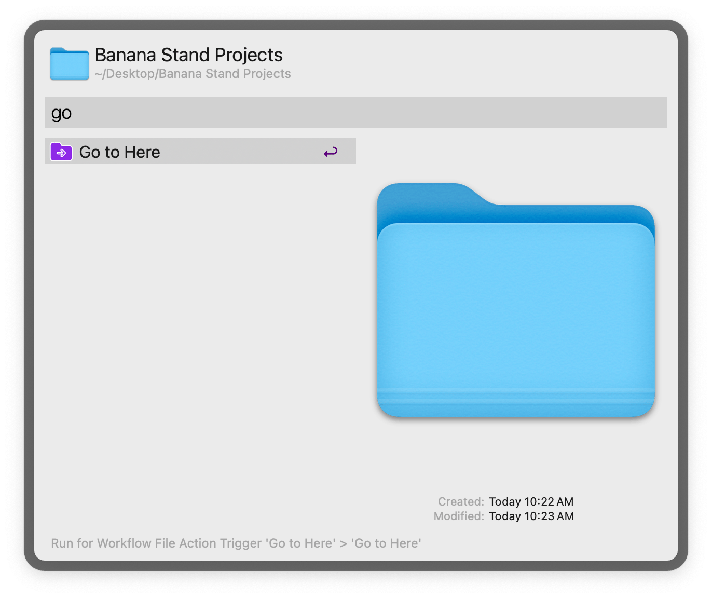

## Usage

Switch the selected path in a macOS Open/Save (and similar) dialog via the Universal Action.

This can also be used to navigate the currently focused Finder window to the chosen path.

Alternatively, filter for paths of open Finder windows and tabs with the `gtf` keyword, or search files and folders with `gth`.

The workflow recognizes dialog windows based on the action button name. Button names recognized by default: “Open”, “Save”, “Export”, “Move”, “Select”, “Upload”, “Choose”, and “Choose file”. Non-English users can change or add to these strings in the Workflow’s Configuration, along with adjusting the speed of execution in case of slower machines.

In the Finder, the workflow switches the currently focused tab/window to the chosen path. If no window is open, it will open a new one.
