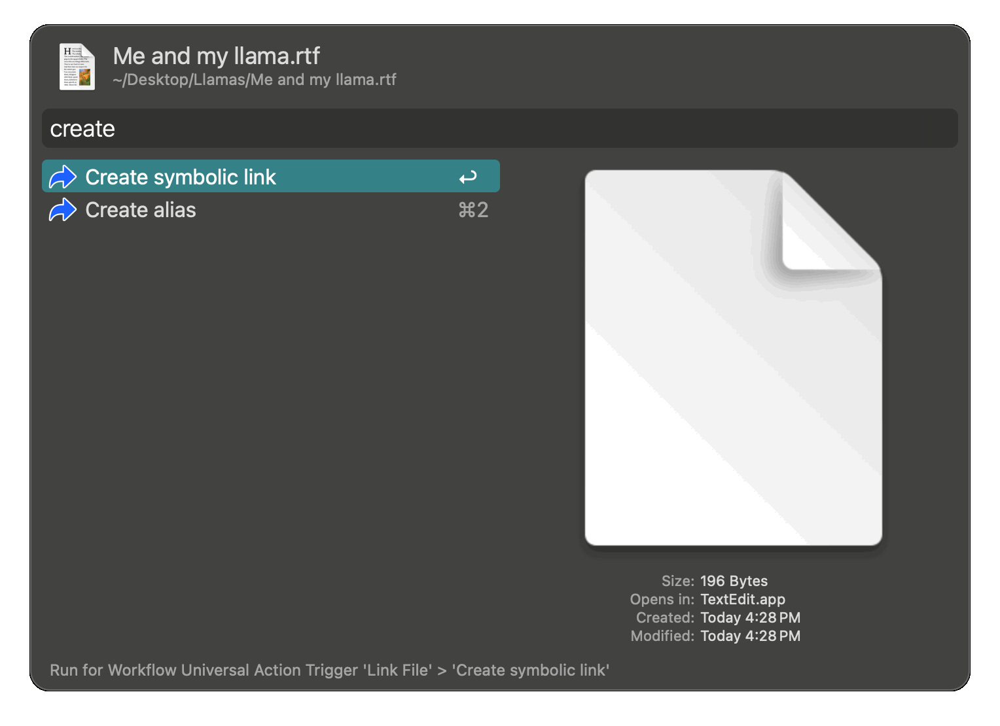

## Usage

Create a symbolic link or Finder alias via the [Universal Actions](https://www.alfredapp.com/help/features/universal-actions/).

- <kbd>↩︎</kbd> Place the link in the same folder as the source
- <kbd>⌥</kbd><kbd>↩︎</kbd> Use Alfred to move the link to another location

Aliases are renamed according to Finder's behavior. Symbolic links are renamed in the same way, to avoid overwriting files that already exist in the destination path. For example: For a source `foo.txt`, the symlink will be named `foo symlink.txt`, or `foo symlink 2.txt`, etc.

The default suffix ` symlink` can be changed or omitted in the [Workflow Configuration](https://www.alfredapp.com/help/workflows/user-configuration/).
