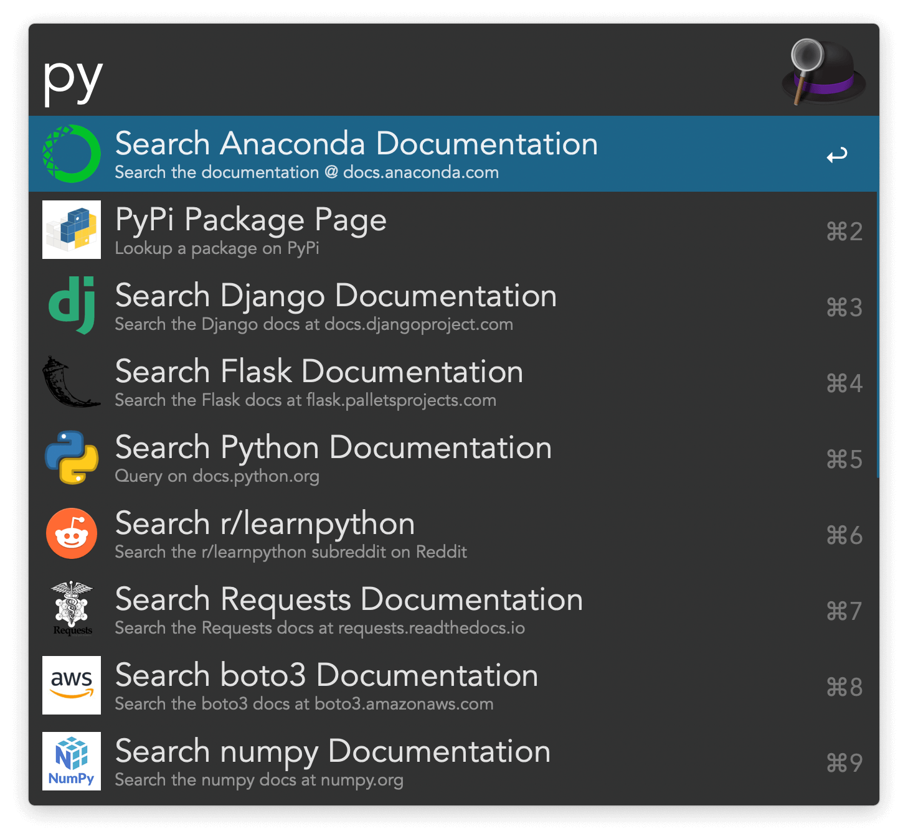

## Usage

Open web searches for different Python web resources via the workflow’s keywords:

* `pydoc` [Python documentation](https://docs.python.org/).
* `pypi` Lookup in [Python Package Index](https://pypi.org).
* `spypi` Search in [Python Package Index](https://pypi.org).
* `pyanaconda` [Anaconda documentation](https://docs.anaconda.com).
* `pyreddit` [r/LearnPython subreddit](https://www.reddit.com/r/learnpython/).
* `pydjango` [Django documentation](https://docs.djangoproject.com/en/4.1/).
* `pyflask` [Flask documentation](https://flask.palletsprojects.com/).
* `pyrequests` [Requests documentation](https://requests.readthedocs.io/en/latest/).
* `pyboto3` [Boto3 documentation](https://boto3.amazonaws.com/v1/documentation/api/latest/index.html).
* `pyurllib3` [urllib3 documentation](https://urllib3.readthedocs.io/en/stable/).
* `pypandas` [Pandas documentation](https://pandas.pydata.org).
* `pypip` [pip documentation](https://pip.pypa.io/).
* `pynumpy` [NumPy documentation](https://numpy.org/doc/stable/).

