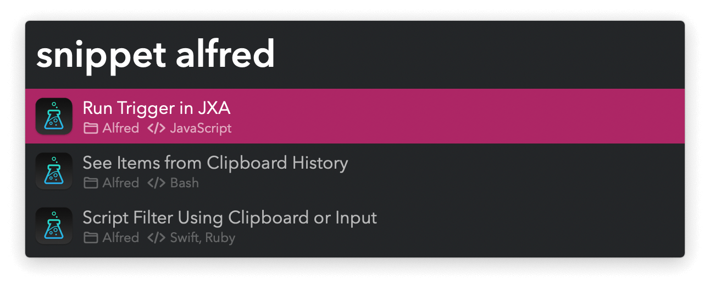

## Setup

Install the workflow from the SnippetsLab app.

In the menubar: `SnippetsLab` → `Settings…` → `Integrations` → `Install Workflow`.

## Usage

Search SnippetsLab via the `snippet` keyword.

* <kbd>↩</kbd> Primary action. Defaults to “Copy to Clipboard”.
* <kbd>⌥</kbd><kbd>↩</kbd> Secondary action. Defaults to “Open in Main App”.
* <kbd>⌘</kbd><kbd>↩</kbd> Paste to frontmost app.

Change the primary and secondary actions in SnippetsLab Settings → Assistant.
