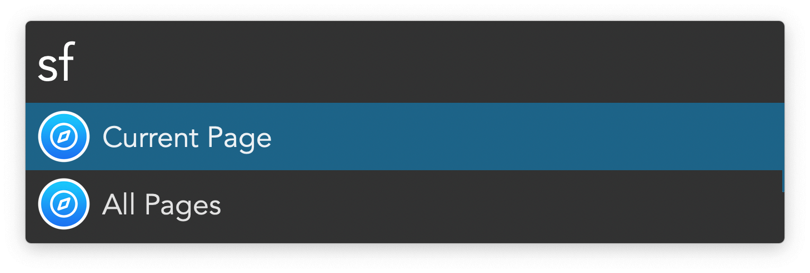
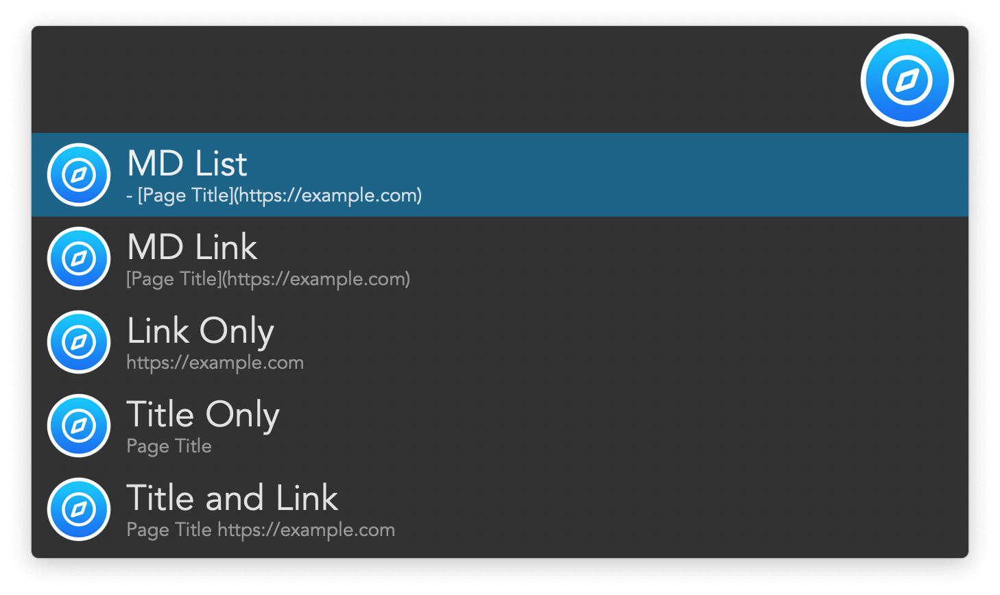

## Usage

Copy the title and URL from Safari tabs via the `sf` keyword.

When copying multiple pages, specify tabs by their position. Example: `2 5 6` will copy information from the second, fifth, and sixth tabs.

