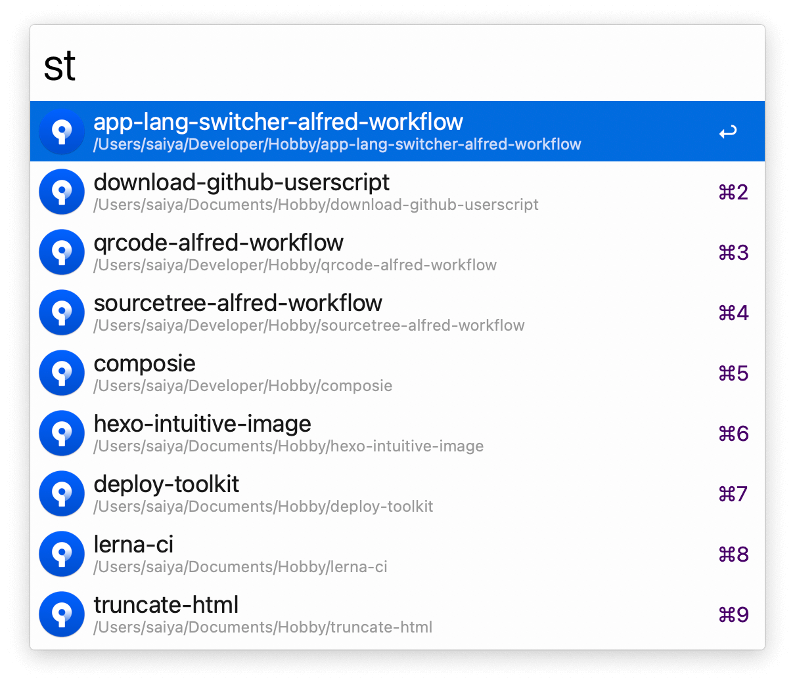

## Usage

Search your SourceTree bookmarks via the `st` keyword.

* <kbd>↩</kbd> Open repository in SourceTree.
* <kbd>⌥</kbd><kbd>↩</kbd> Reveal in Finder.
* <kbd>⌘</kbd><kbd>↩</kbd> Open in your code editor (set it in the Workflow’s Configuration).
