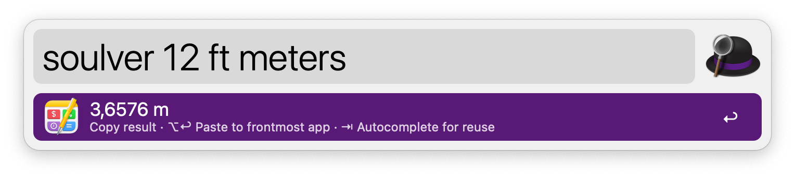
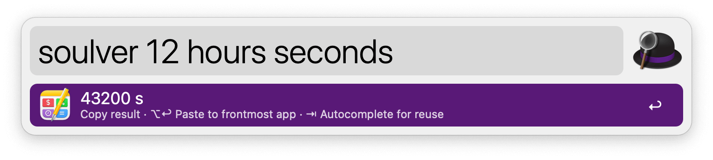

## Setup

Install the workflow from the Soulver app.

In the menubar: `Soulver 3` → `Integrations` → `Alfred Workflow…`

## Usage

Perform different calculations through Soulver via the `soulver` keyword.

* <kbd>↩</kbd> Copy result to the clipboard.
* <kbd>⌥</kbd><kbd>↩</kbd> Paste result to frontmost app.
* <kbd>⇥</kbd> Autocomplete result to use in next calculation.
