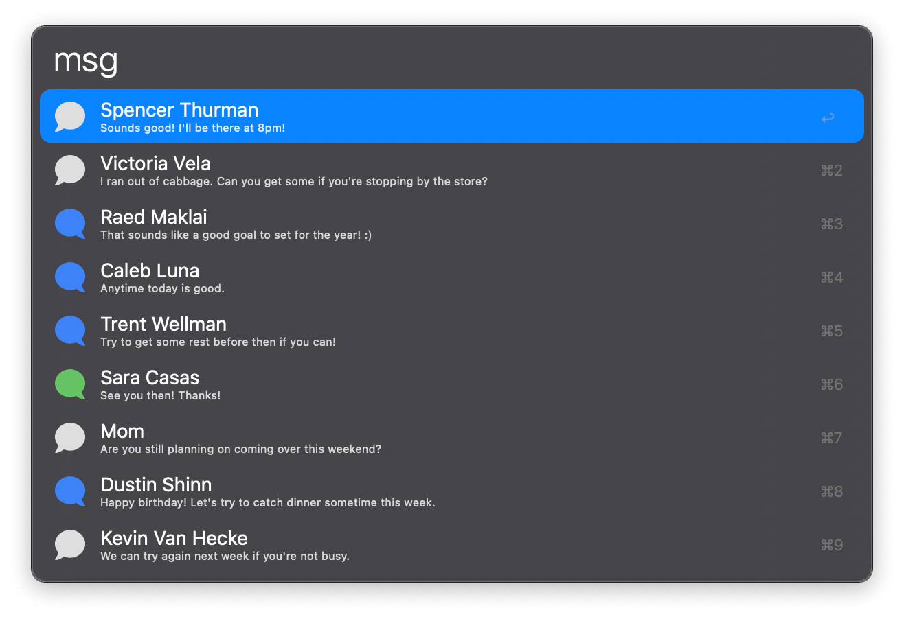

## Usage

See your latest conversations in Messages via the `msg` keyword.

* <kbd>↩</kbd> Reply.
* <kbd>⌘</kbd><kbd>↩</kbd> Export conversation as PDF.
* <kbd>⌥</kbd><kbd>↩</kbd> Export conversation as HTML.
* <kbd>⌘</kbd><kbd>Y</kbd> Quick Look the conversation.
