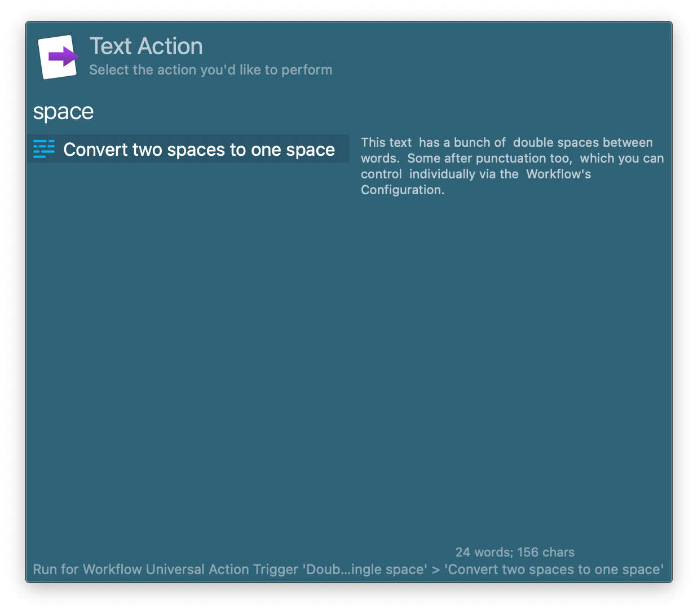

## Usage

Collapse duplicate spaces to a single space in selected text or Clipboard History via the Universal Action. 

Double spaces following a word are always pared down, but double spaces  following other characters can be configured in the Workflow’s Configuration.
