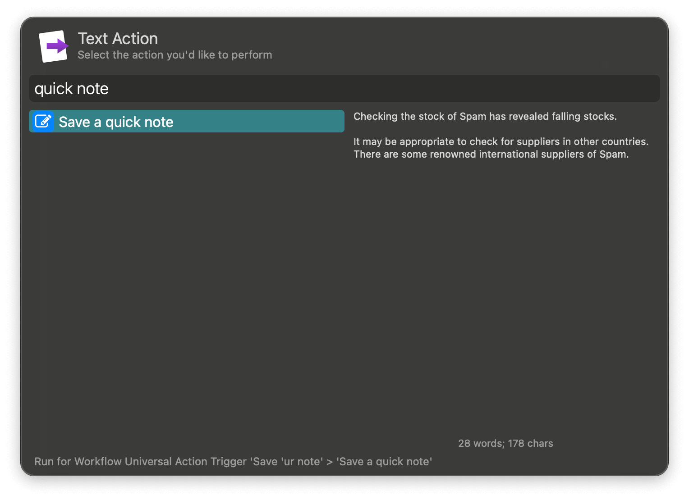
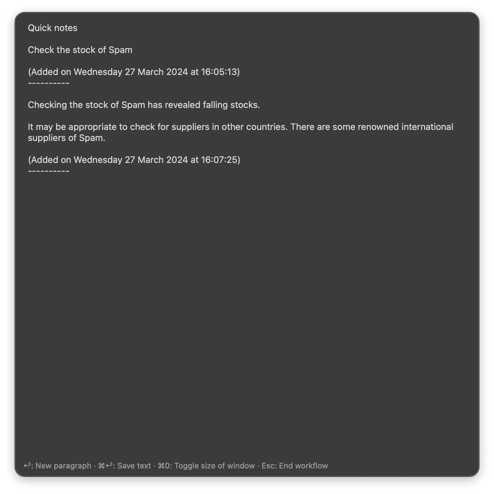

## Usage

### Create

Save a quick one line note via the `cqn` keyword.

Start a multi-line note with the `cqp` keyword followed by <kbd>↩</kbd>. Press <kbd>⌘</kbd><kbd>↩</kbd> to save the text.

Alternatively, create a new note from a selection or Clipboard History via the Universal Action.

### View

View your quick notes with the `vqn` keyword.

### Edit

Edit the QuickNote file via the `eqn` keyword.

### Delete

Delete the QuickNote file with the `dqn` keyword.

