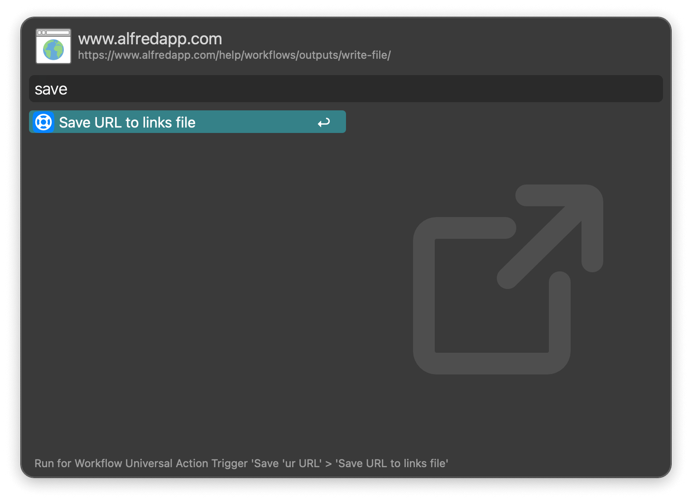
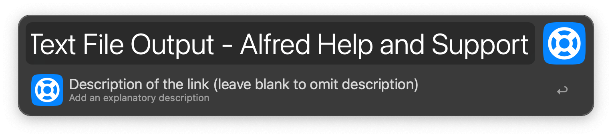
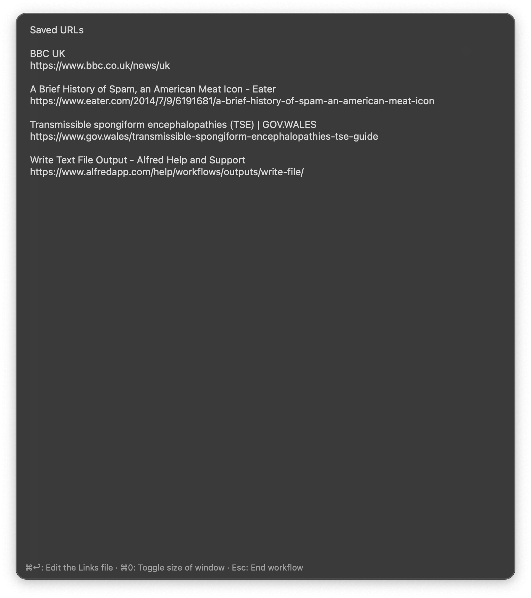
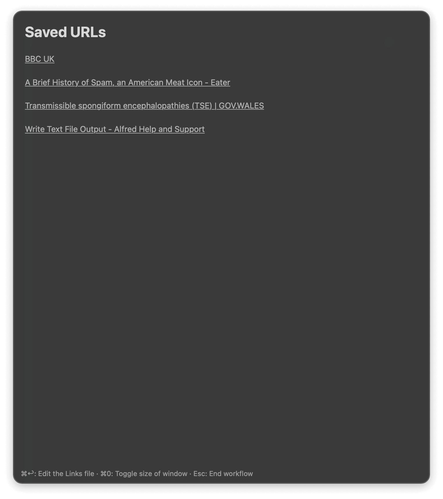
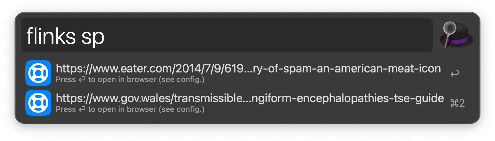

## Usage

Save a selected URL from your browser or Clipboard History via the Universal Action.

Providing a title is optional for a plain text file but mandatory for a markdown file.

### View and Clear

View saved links with the `links` keyword. <kbd>⌘</kbd><kbd>↩</kbd> to trash the file and start over.

Links are shown in plain text or markdown, depending on the Workflow’s Configuration.

Editing a plain text links file with <kbd>⌘</kbd><kbd>↩</kbd> opens it in Alfred’s Text View, while editing a markdown links file opens it in your default markdown editor.

### Search

Search URLs in the links file via the `flinks` keyword. <kbd>↩</kbd> to open in the browser.

