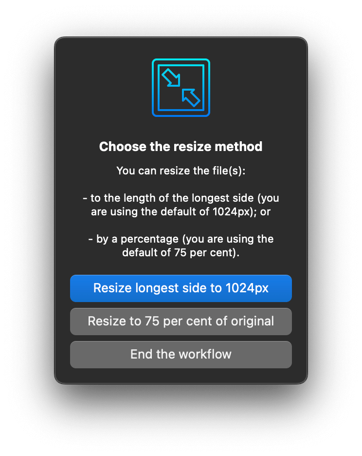

## Usage

Shrink the dimensions of JPEG and PNG images via the Universal Action.

Images won’t be enlarged if they’re smaller than the intended size. Change the default reduction options in the Workflow’s Configuration.
