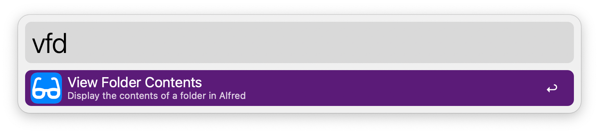
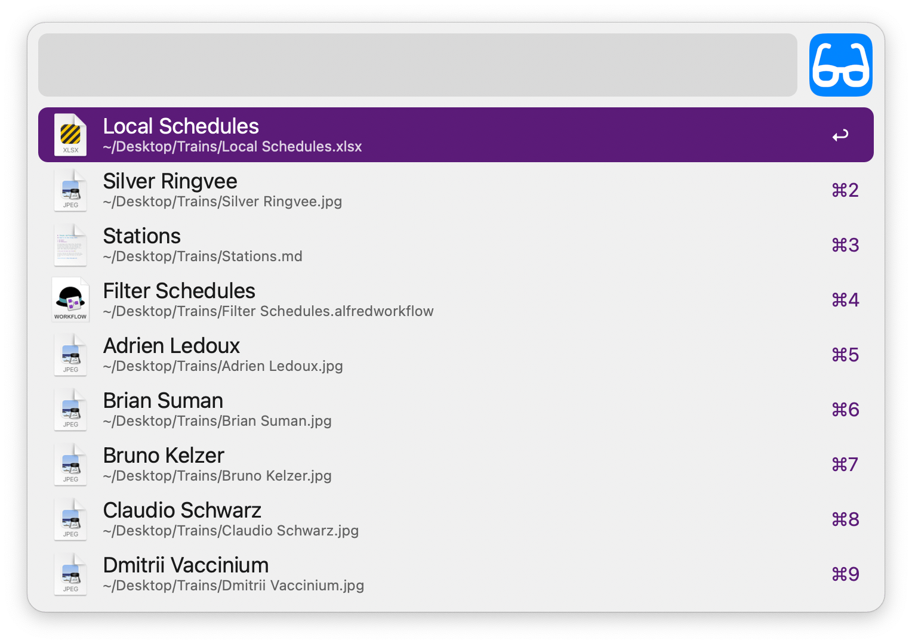
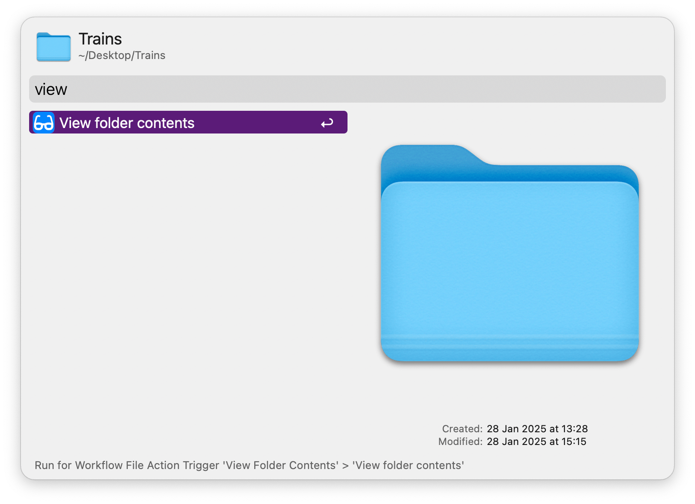

## Usage

Display and search the contents of a configured folder via the `vfd` keyword.

* <kbd>↩</kbd> Open file.

Alternatively, open any folder with the Universal Action.

Or search one with the `vfs` keyword.

