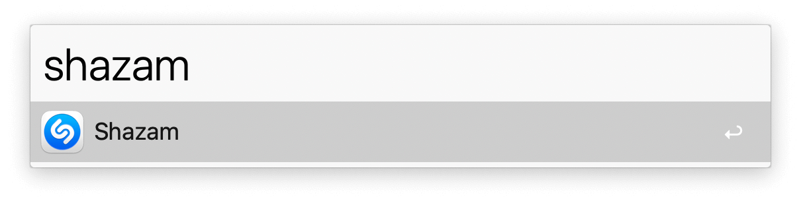
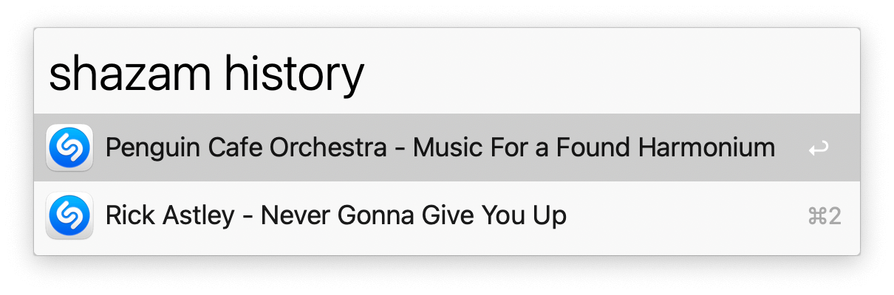

## Usage

Detect what music is playing via the `shazam` keyword.

A notification will show with the result.

View your history with the `shazam history` keyword.

* <kbd>↩</kbd> Copy entry to clipboard.
* <kbd>⌘</kbd><kbd>↩</kbd> Delete entry from history.
* <kbd>⌥</kbd><kbd>↩</kbd> Clear history.
