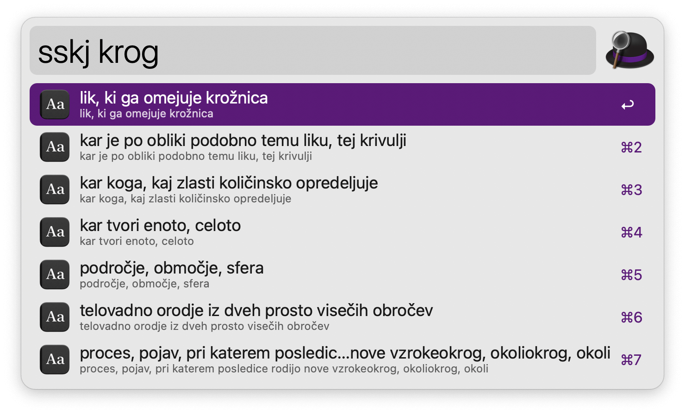
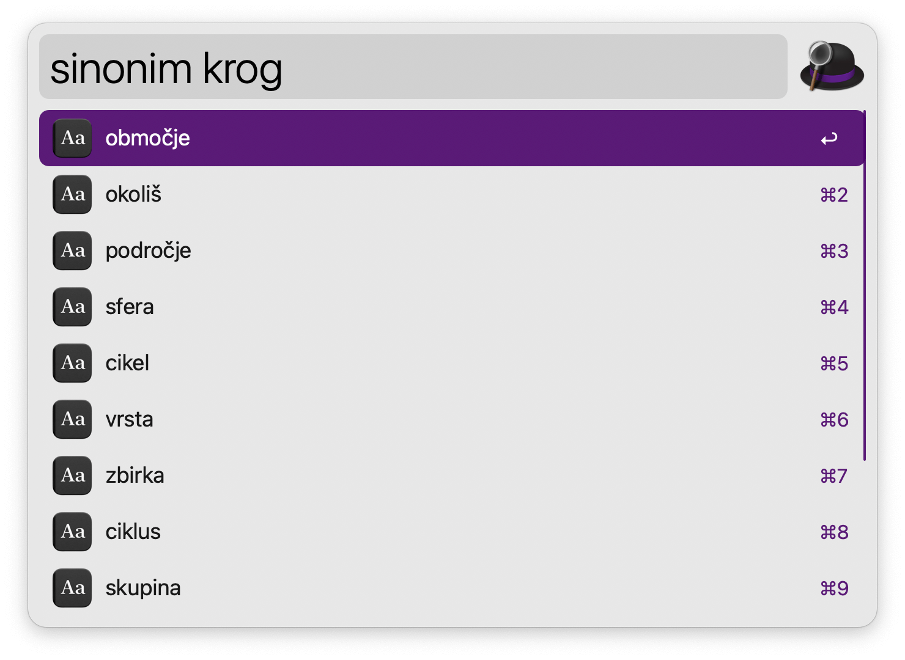
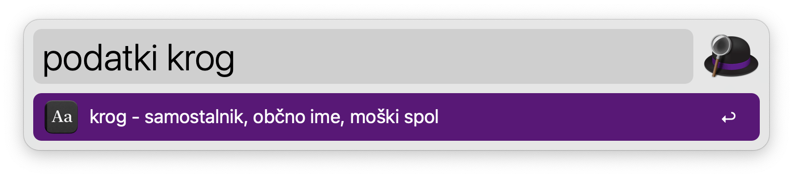
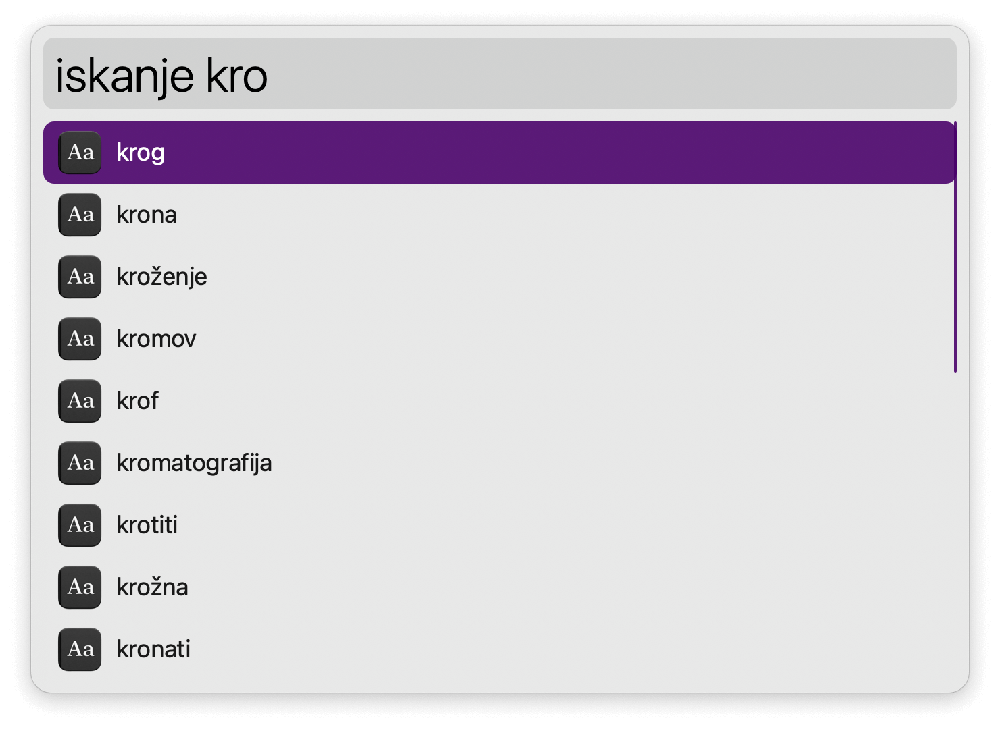

## Usage

Search Slovenian word definitions from [Fran](https://fran.si) via the `sskj` keyword.

Search the Sinonimi [thesaurus](https://sinonimi.si) with the `sinonim` keyword.

Look up word data from [Sloleks](https://viri.cjvt.si/sloleks/slv/) via the `podatki` keyword.

Get live word suggestions with `iskanje`.

* <kbd>↩</kbd> Open in dictionary search.
* <kbd>⌘</kbd><kbd>↩</kbd> Open in thesaurus search.
* <kbd>⌥</kbd><kbd>↩</kbd> Open in web browser.
