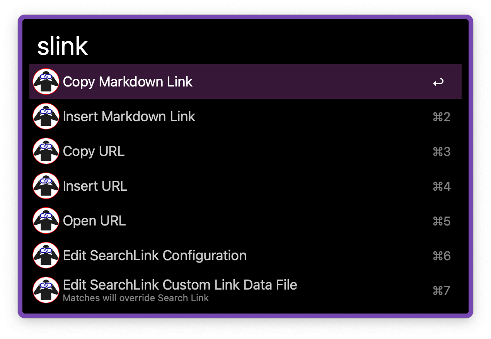
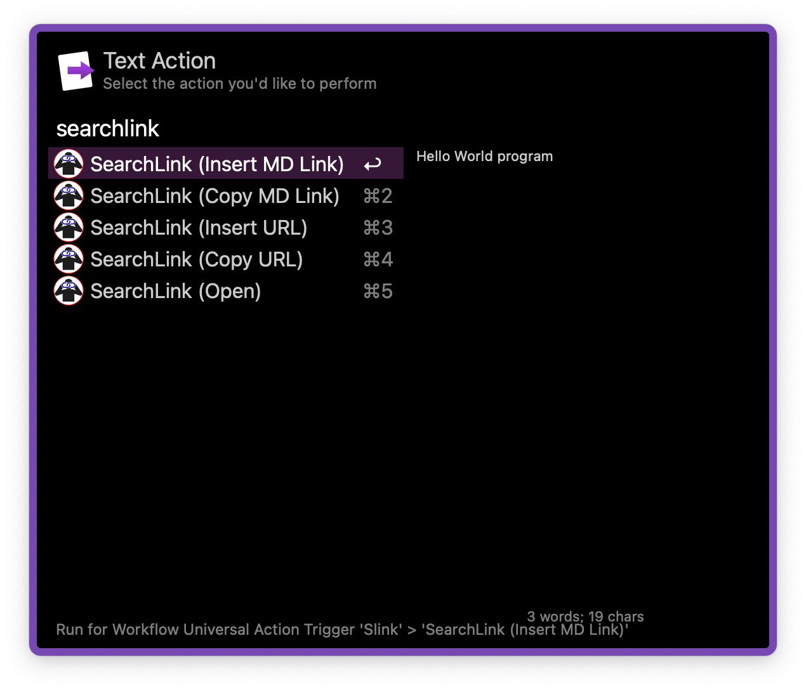
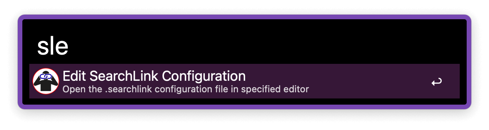

## Setup

Install the [SearchLink System Service](https://brettterpstra.com/projects/searchlink/).

## Usage

Search the web and generate Markdown links for text via the `sl` keyword.

* <kbd>↩</kbd> Convert searched text to a Markdown link.
* <kbd>⌘</kbd><kbd>↩</kbd> Retrieve the result URL.
* <kbd>⌃</kbd><kbd>↩</kbd> Open URL in a web browser.

The result takes about a second to generate. By default it is copied to the clipboard and pasted to the frontmost app but that behaviour can be changed in the Workflow’s Configuration.

Either action can be forced with the `sli` and `slc` keywords. The former always pastes (inserts the text) while the later always copies. List all variations with the `slink` keyword.

Alternatively, use the Universal Actions.

Open the SearchLink configuration for editing with the `sle` keyword.

