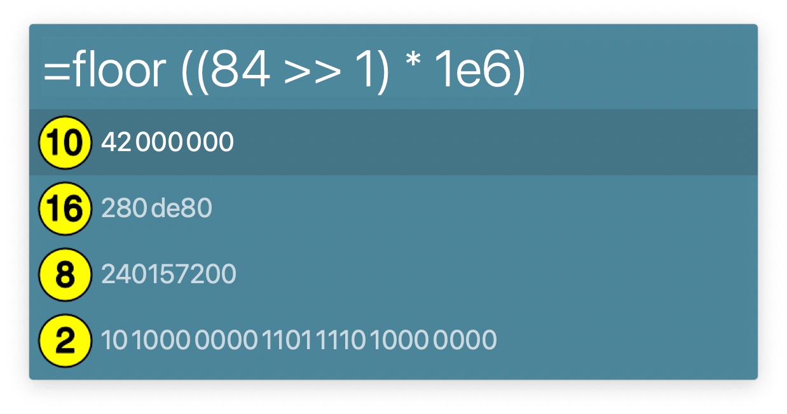
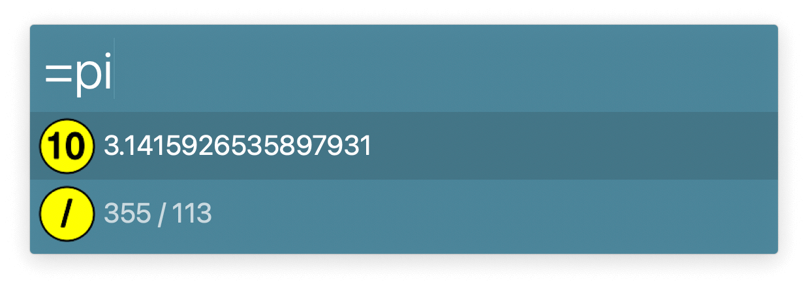

## Usage

Evaluate Lua [numeric expressions](https://www.lua.org/manual/5.4/manual.html#3.4) via the `=` keyword.

Results show in decimal, hexadecimal, binary, and octal notations. Everything from the [Lua math library](https://www.lua.org/manual/5.4/manual.html#6.7) is available, in addition to `log10()` and `e`.
