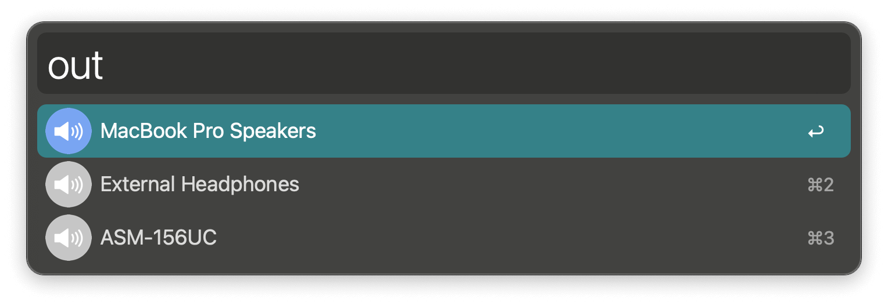
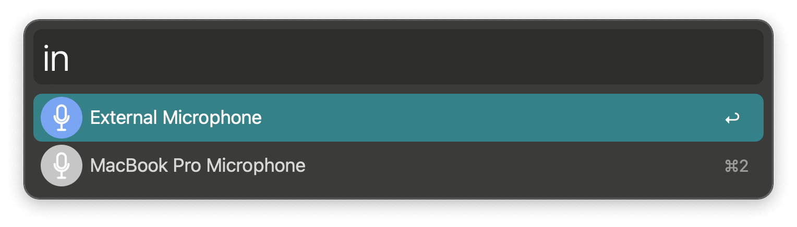
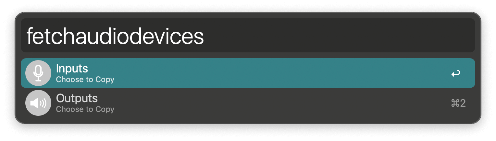
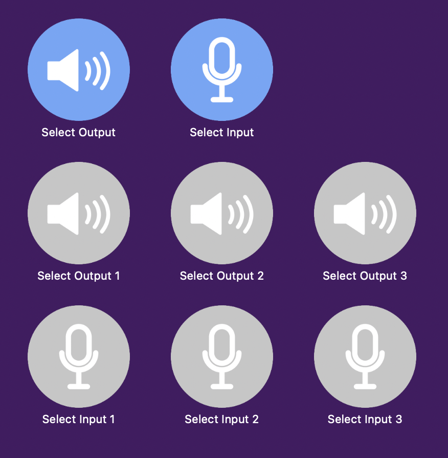

## Usage

Switch between audio output devices (like speakers) via the `out` keyword and audio input devices (like microphones) with `in`.

Configure the Hotkeys for faster triggering of up to three input and three output devices or to rotate through favourites.

In the Workflow’s Configuration you can filter out devices that should not show up in the suggestions. To make this easier, the `fetchaudiodevices` keyword can copy names of output or input devices to the clipboard.

Commands are included for [Alfred Remote](https://www.alfredapp.com/remote/).

