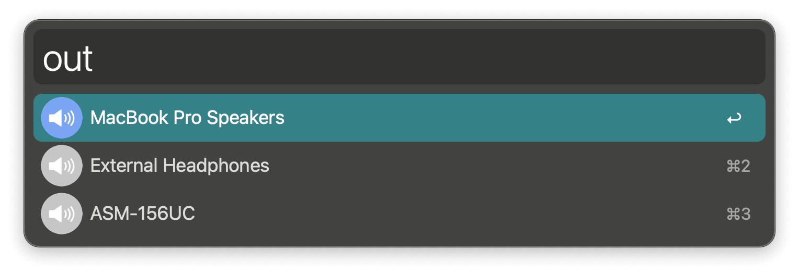
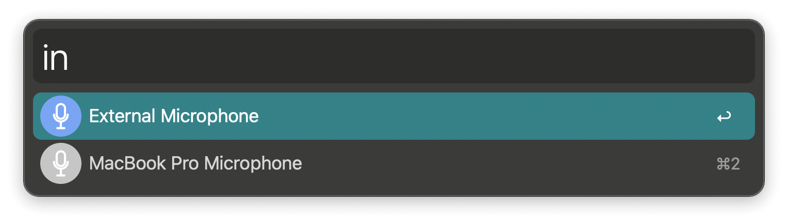
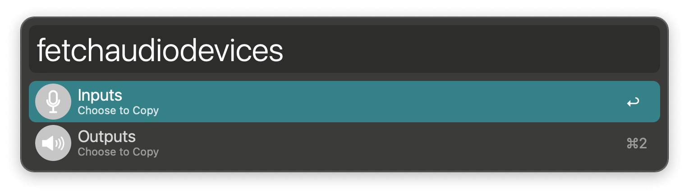
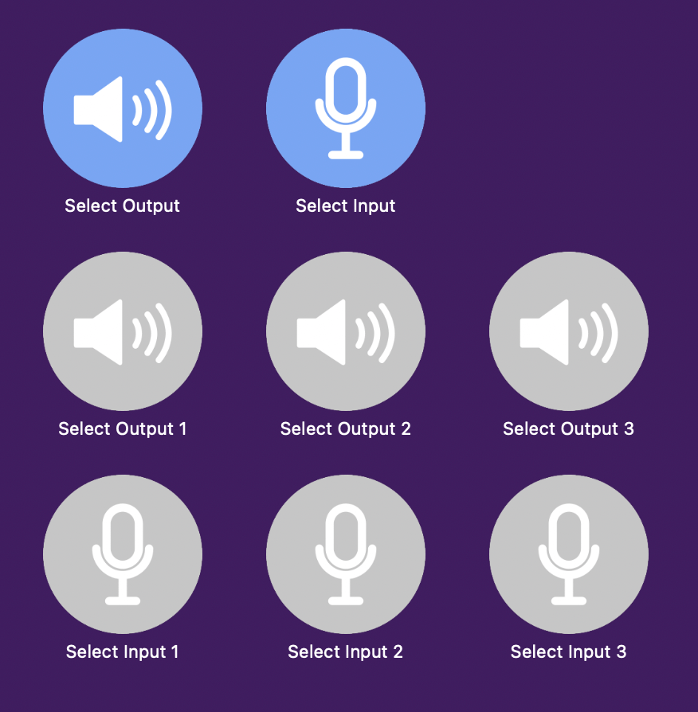

## Usage

Switch between audio output devices (like speakers) via the `out` keyword and audio input devices (like microphones) with `in`.

Configure the Hotkeys for faster triggering of up to three input and three output devices or to rotate through favourites.

In the Workflow’s Configuration you can choose favourites and filter out devices that should not show up in the suggestions. Each entry can be a device **name** or its stable **UID** — use a UID to target one specific device when two share the same name (for example two identical monitors). Add `;Your Label` after the name or UID to give a device a friendly name that is shown in Alfred and in the switch notifications.

To make this easier, the `fetchaudiodevices` keyword copies ready-to-paste `UID;Name` lines for the output or input devices to the clipboard. You can also hold ⌥ while selecting a device in the `out`/`in` list to copy just that device’s line.

Commands are included for [Alfred Remote](https://www.alfredapp.com/remote/).

