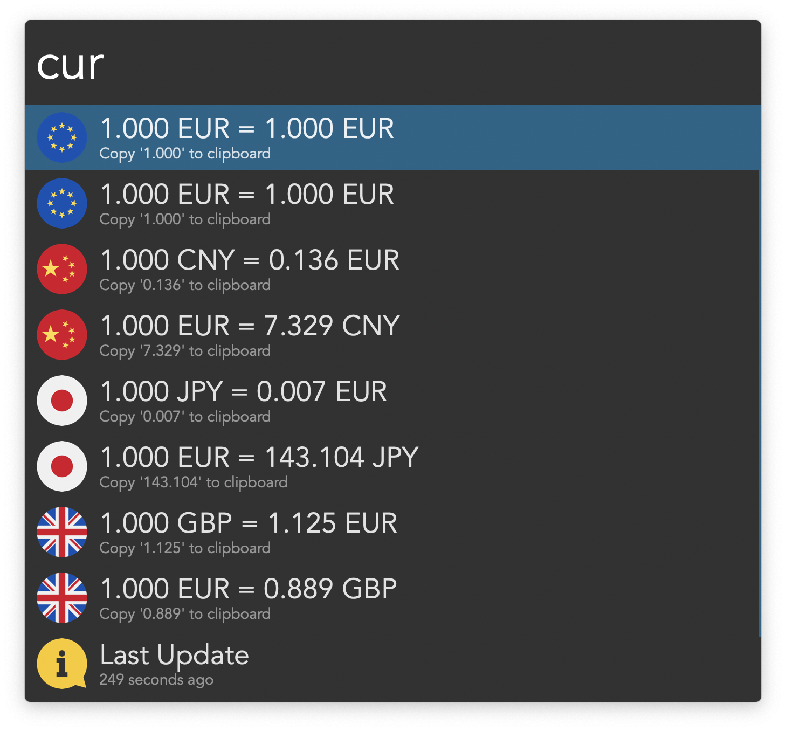
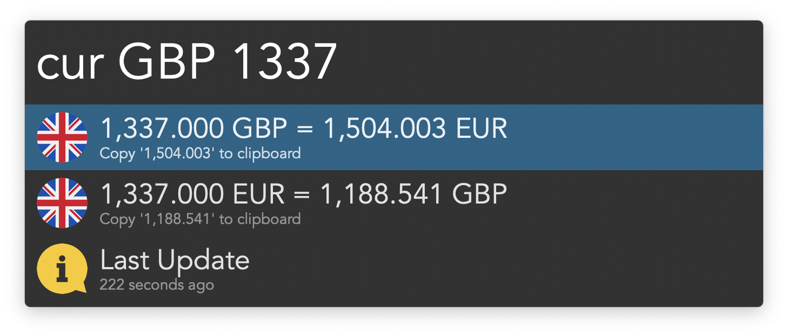
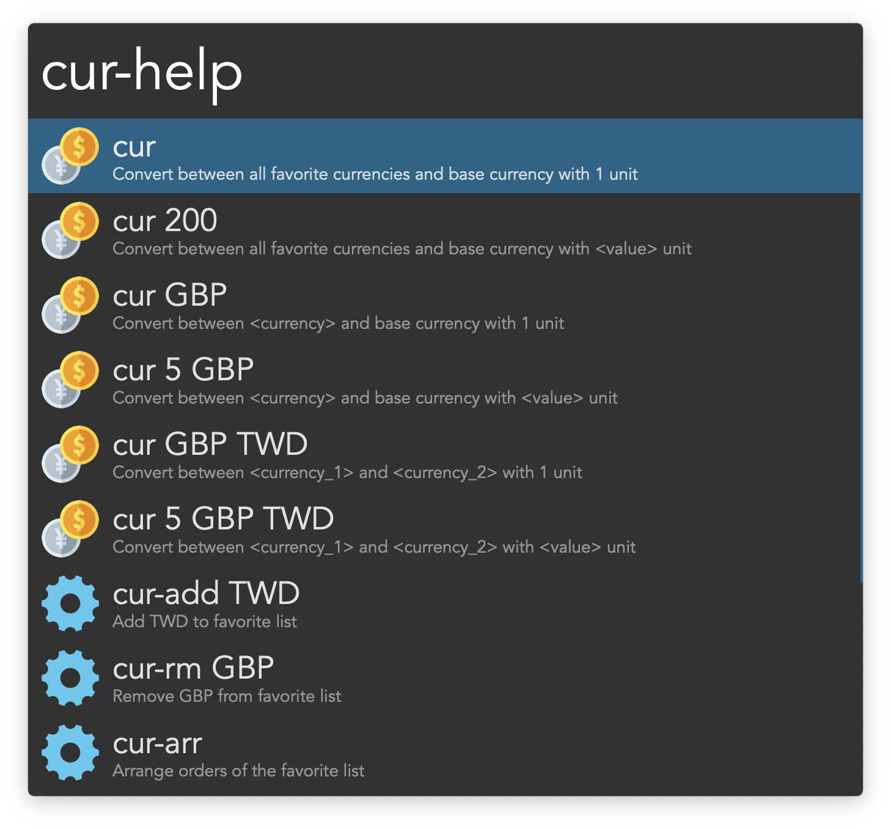

## Usage

Convert to and from your primary currency (customisable in the Workflow’s Configuration) via the `cur` keyword. Type to filter for specific currencies or convert specific values. <kbd>↩</kbd> to copy the conversion.

Configure the Hotkey for faster triggering.

Add other currencies to your favourites via `cur-add`. Remove them with `cur-rm` and change their order via `cur-arr`.

Create aliases for currencies, so you do not have to type their official code, via `cur-alias`. Remove them with `cur-unalias`.

Learn more about all options via the `cur-help` keyword.

