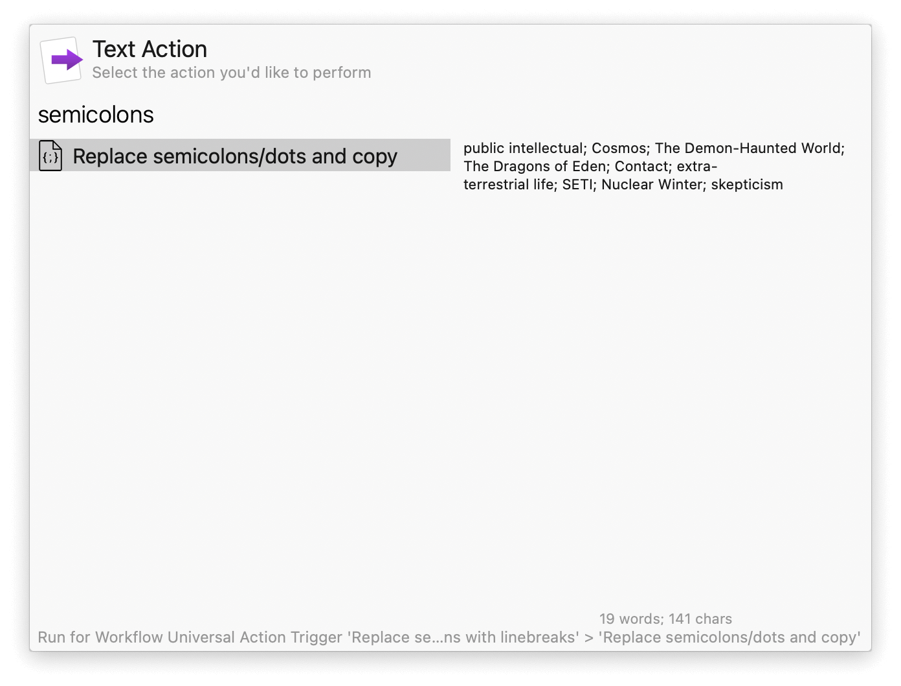

## Usage

With the Universal Action, replace semicolons and dot separators with newlines in selected text or an item from Clipboard History. Press <kbd>⌥</kbd><kbd>↩</kbd> to replace commas instead. This is particularly useful to split keywords from academic articles to a format suitable for Zotero and other reference managers.

Alternatively, configure the Hotkeys for replacing the text currently in your clipboard.
