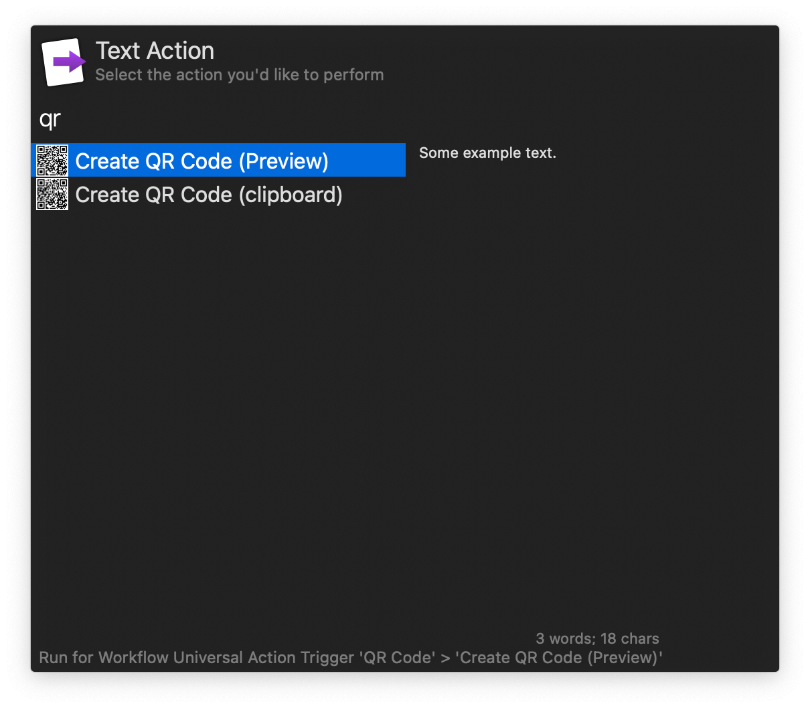

## Usage

Generate a QR code by providing text to the `qrp` or `qrc` keywords. The former opens the image in Preview while the latter copies it to the clipboard.

Configure the Hotkey or use the Universal Actions to generate QR codes from selected text.

