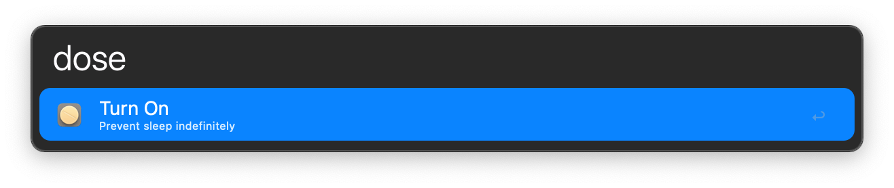
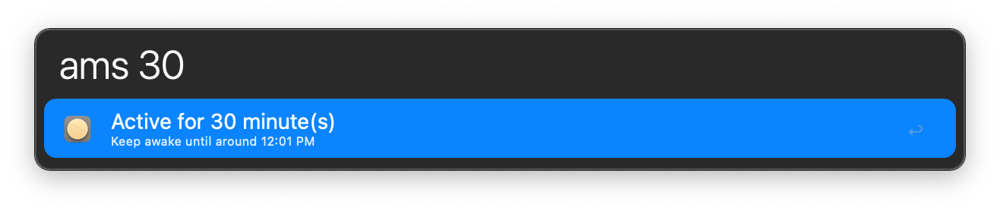
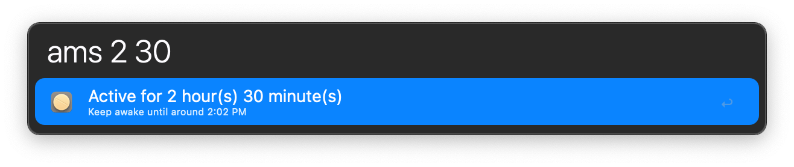
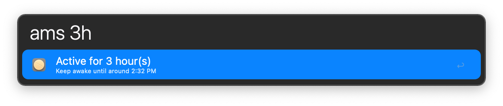
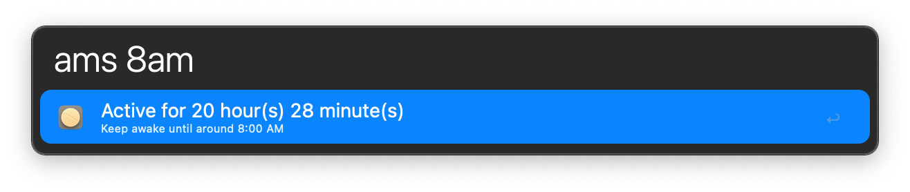
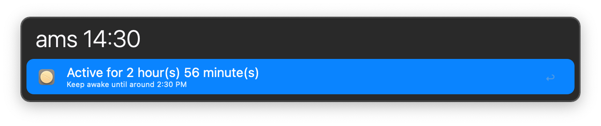
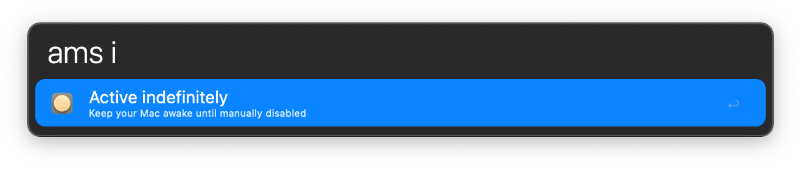

## Usage

Turn Amphetamine on or off via the `dose` keyword.

* <kbd>↩</kbd> Toggle on or off.
* <kbd>⌘</kbd><kbd>↩</kbd> Toggle and allow display sleep.

Set Amphetamine to keep your Mac awake for a specified amount of time or until a certain time via the `ams` keyword.

Give `i` as the argument to keep awake indefinitely.

