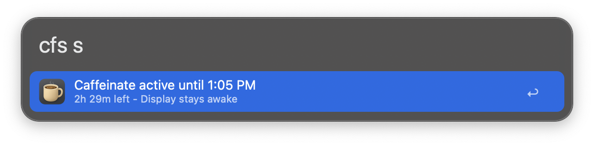

## Usage

Toggle keeping your Mac awake via the `coffee` keyword.

* <kbd>↩︎</kbd> Toggle letting macOS sleep.
* <kbd>⌘</kbd><kbd>↩︎</kbd> Toggle letting macOS sleep and allow display sleep.

Keep your Mac awake for a specified amount of time or until a certain time via the `cfs` keyword.

Give `i` as the argument to keep awake indefinitely.

Give `s` as the argument to check out the status.

Configure the Hotkey to trigger the `coffee` toggle action. 
