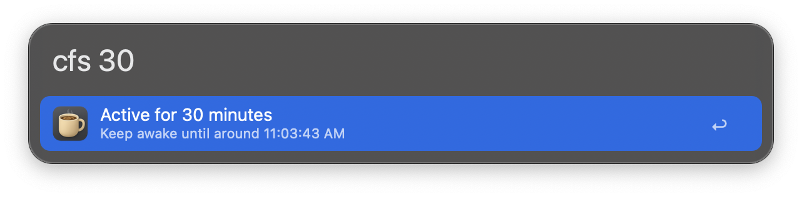
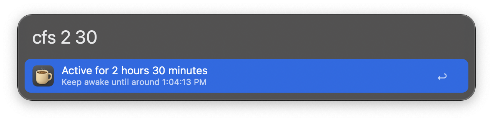
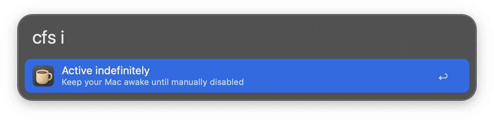

## Usage

Toggle keeping your Mac awake via the `caff` keyword.

* <kbd>↩︎</kbd> Toggle letting macOS sleep.
* <kbd>⌘</kbd><kbd>↩︎</kbd> Toggle letting macOS sleep and allow display sleep.

Keep your Mac awake for a specified amount of time or until a certain time via the `cfs` keyword.

Give `i` as the argument to keep awake indefinitely.

Give `d` as the argument to deactivate Caffeinate.

Give `s` as the argument to check out the session details, including time left and whether display sleep is allowed.

Configure the Hotkeys for faster triggering. Define the time format in the Workflow’s Configuration.
