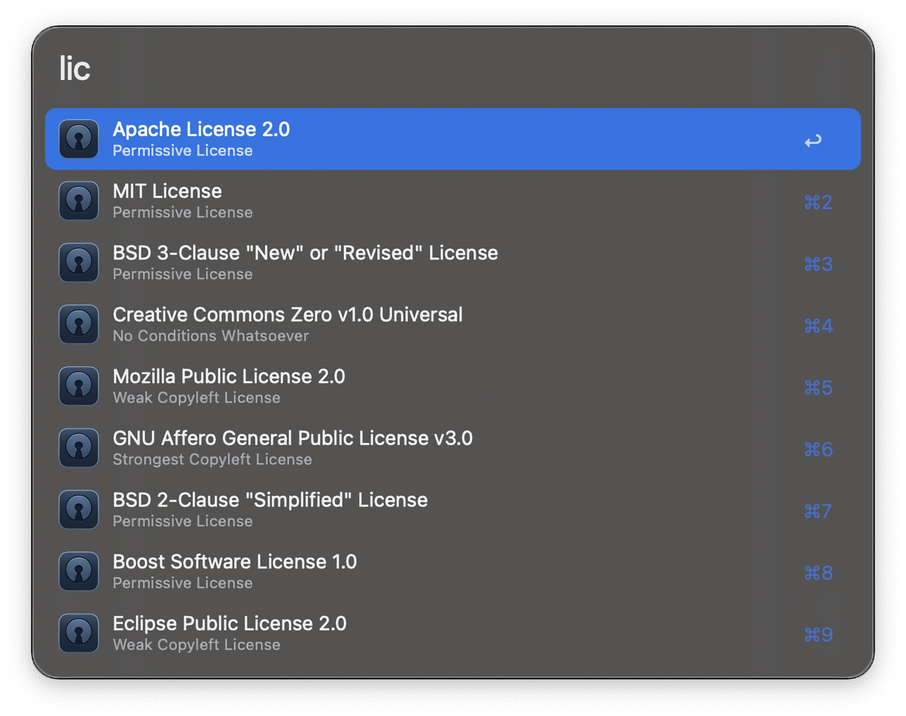
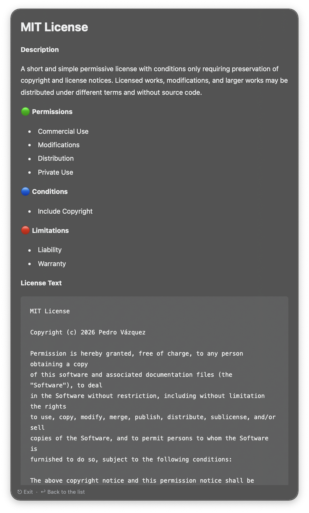

## Usage

Choose a license from the most commonly used licenses on GitHub via `lic` keyword.

* <kbd>↩</kbd> Copy license to clipboard.
* <kbd>⌘</kbd><kbd>↩</kbd> Paste license in frontmost app.
* <kbd>⌥</kbd><kbd>↩</kbd> View license details in Text View.

