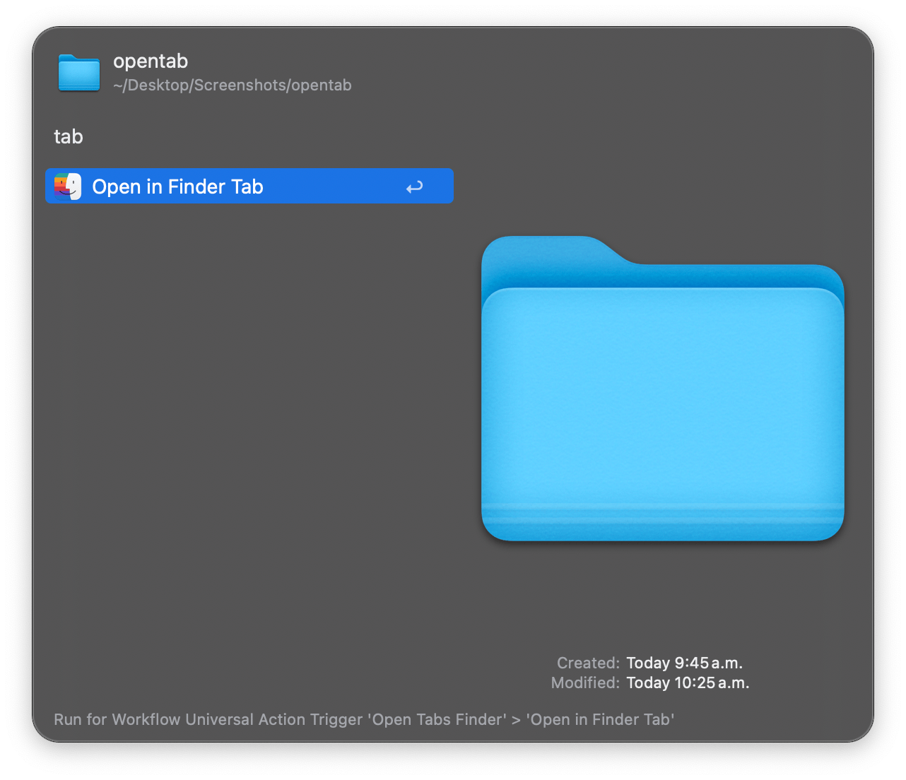

## Usage

Open folders in new Finder tabs via the `ot` keyword.

* <kbd>↩︎</kbd> Open the folder in a new Finder tab.

Alternatively, open one or multiple Finder tab via the Universal Action.

Configure the Hotkey to trigger the `ot` search instantly. 
