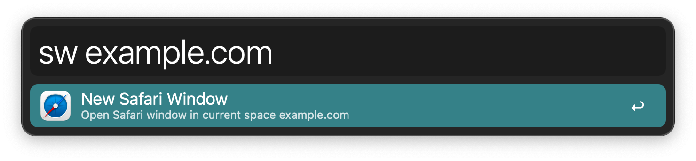
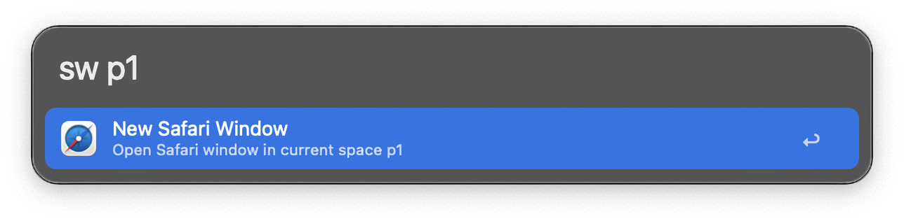
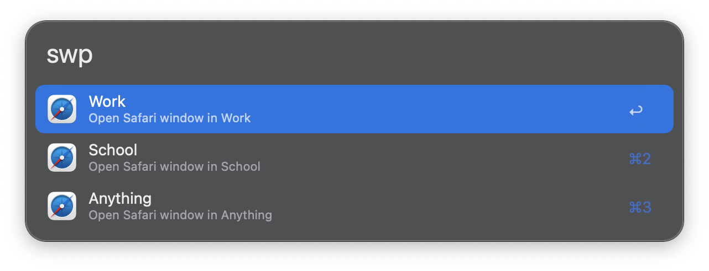
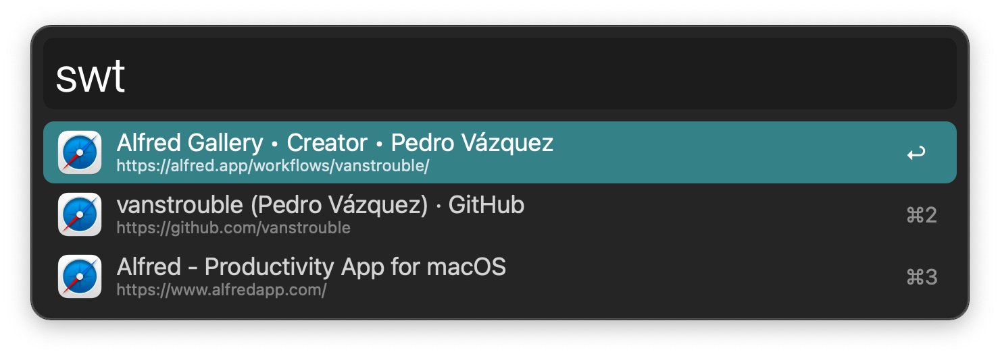
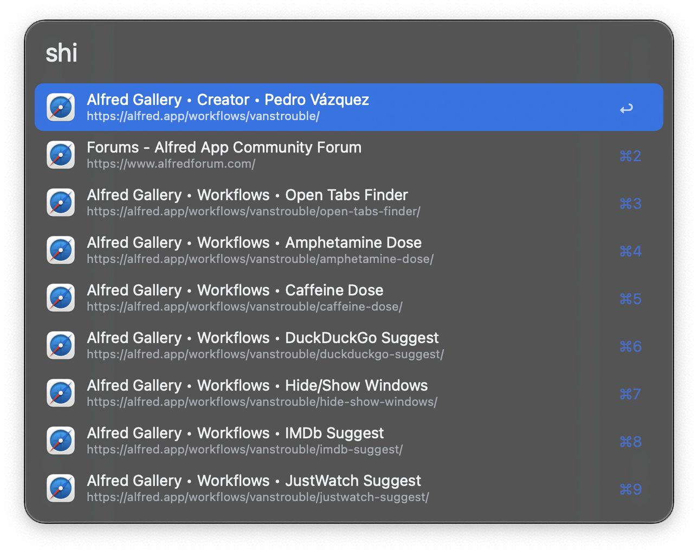
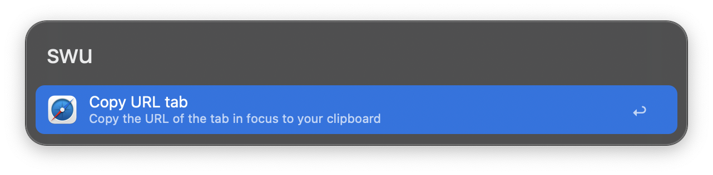
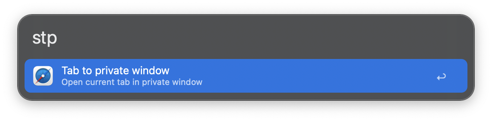

## Usage

Open a new Safari window in your current space via the `sw` keyword. You can give it a URL as the argument to open it, `xN` to open `N` windows, or `pN` to open profile `N`.

* <kbd>↩︎</kbd> Open new window.
* <kbd>⌘</kbd><kbd>↩︎</kbd> Open new Private window.

Show available Safari profiles via the `swp` keyword. Set profiles in the Workflow’s Configuration.

List all open Safari tabs and select one to focus with the `swt` keyword.

* <kbd>↩︎</kbd> Focus selected tab.
* <kbd>⌘</kbd><kbd>↩︎</kbd> Copy tab URL.
* <kbd>⌥</kbd><kbd>↩︎</kbd> Edit tab URL.
* <kbd>⌃</kbd><kbd>↩︎</kbd> Close all tabs with this URL.

Show recent Safari history via `shi` keyword.

* <kbd>↩︎</kbd> Open selected history item.
* <kbd>⌘</kbd><kbd>↩︎</kbd> Copy URL to clipboard.
* <kbd>⌥</kbd><kbd>↩︎</kbd> Edit URL.

Copy the current tab URL via `swu` keyword.

Open the current tab in a new private Safari window via the `stp` keyword.

* <kbd>↩</kbd> Open tab in new private window.
* <kbd>⌘</kbd><kbd>↩</kbd> Close tab and reopen in private window.

Configure the Hotkeys for faster triggering.
