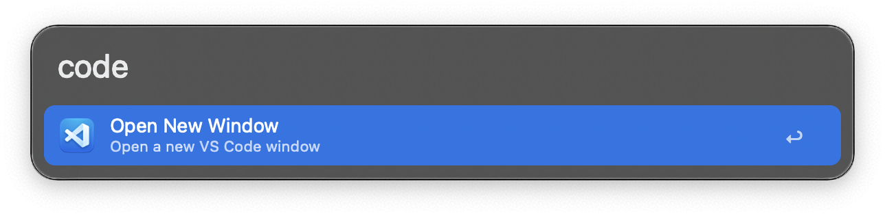
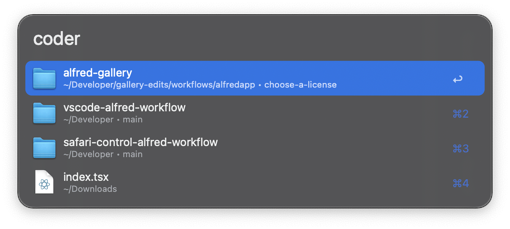
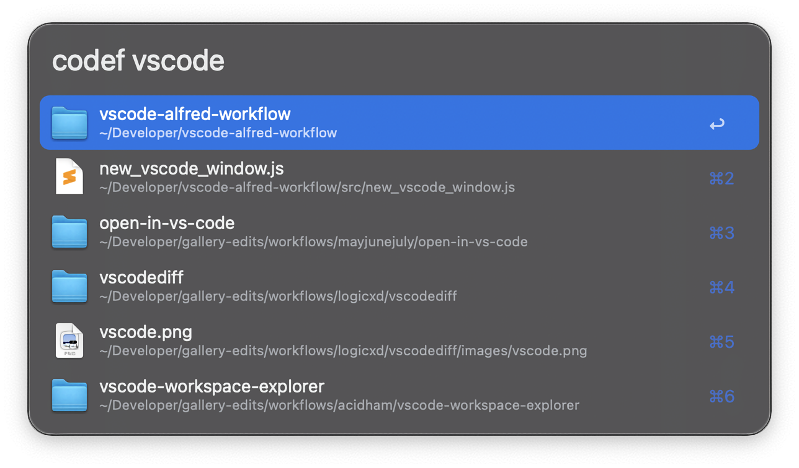
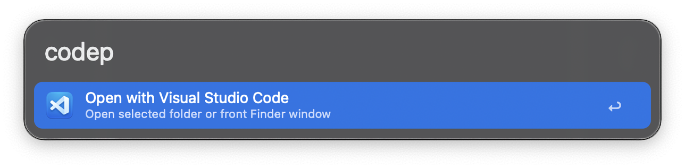
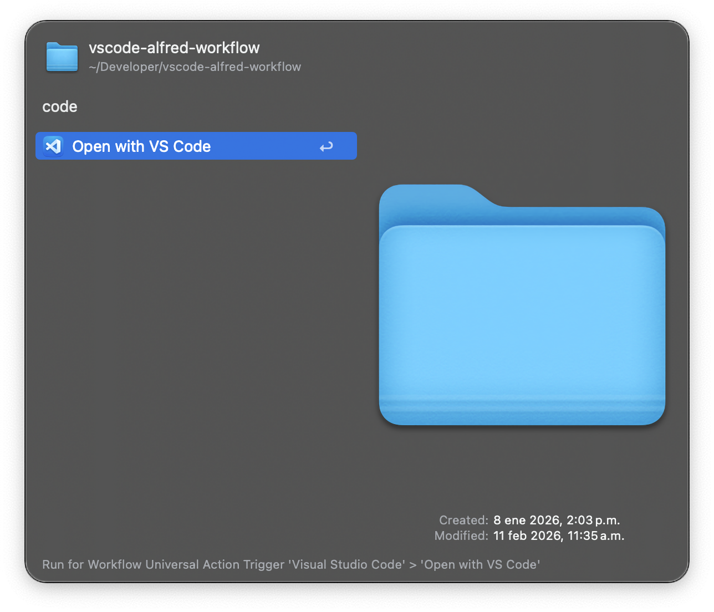
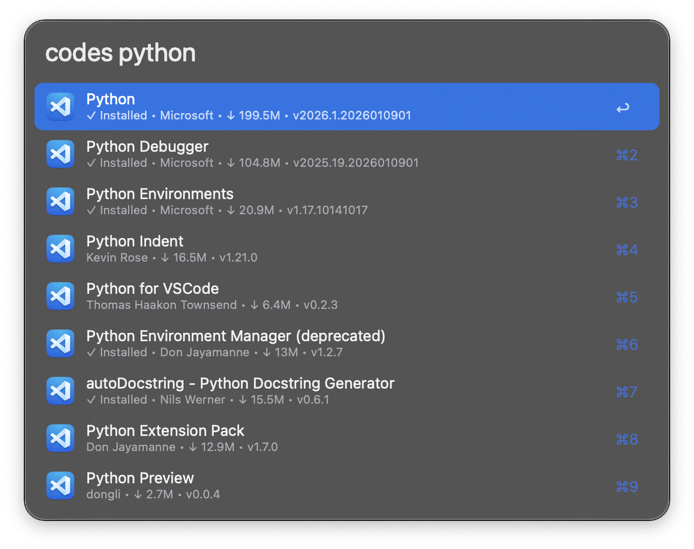
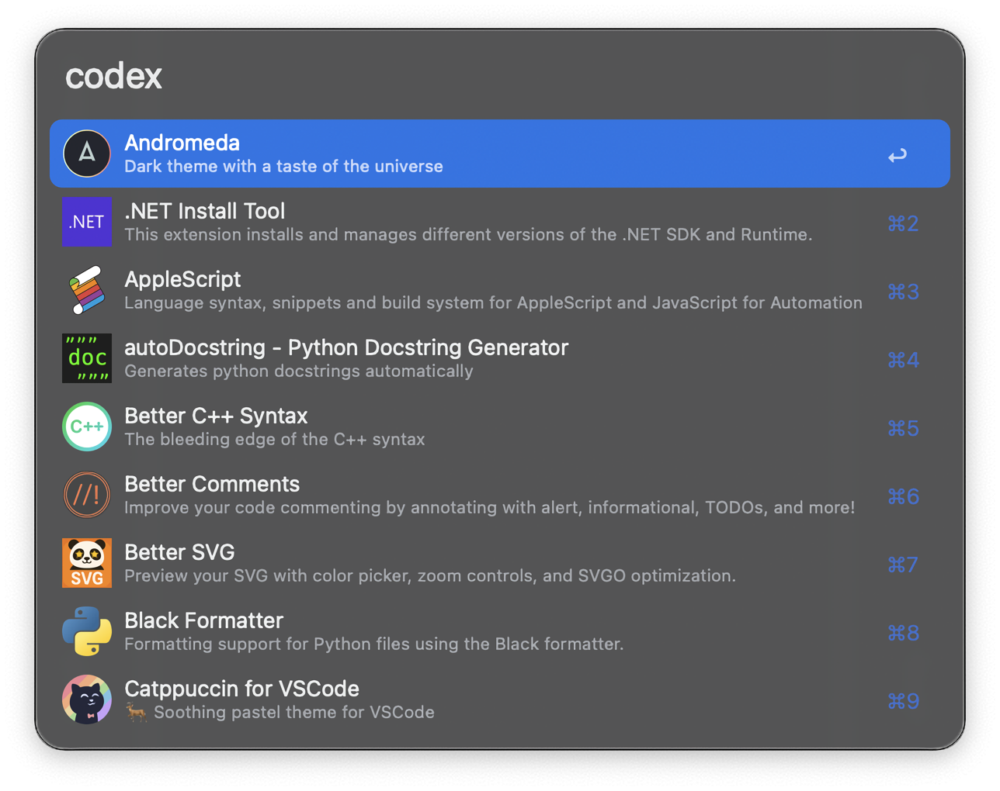

## Usage

Open a new Visual Studio Code window in your current space via the `code` keyword.

* <kbd>↩︎</kbd> Open new window.

Browse your recently opened projects, workspaces, and files with the `coder` keyword.

* <kbd>↩︎</kbd> Open selected project.
* <kbd>⌃</kbd><kbd>↩︎</kbd> Remove from recent projects.
* <kbd>⇧</kbd><kbd>⌃</kbd><kbd>↩︎</kbd> Remove all recent projects.

Search for any file or folder on your Mac and open it directly in VS Code via the `codef` keyword.

* <kbd>↩︎</kbd> Open selected folder.

Open any folder in VS Code by giving its path to the `codep` keyword. If you don't provide a path, the current selection or open Finder window will be opened.

Alternatively, open any file or folder via the Universal Action.

* <kbd>↩︎</kbd> Open the given path or the selected folder.

Search the VS Code Marketplace with the `codes` keyword.

* <kbd>↩︎</kbd> Install extension.
* <kbd>⌘</kbd><kbd>↩︎</kbd> Open extension in Visual Studio Code.

List all your installed extensions via the `codex` keyword.

* <kbd>↩︎</kbd> Open extension in Visual Studio Code.
* <kbd>⌃</kbd><kbd>↩︎</kbd> Uninstall extension.

Configure the Hotkeys for faster triggering.
