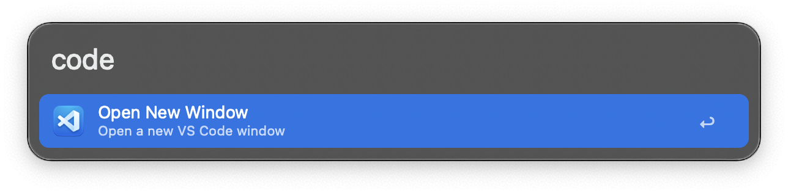
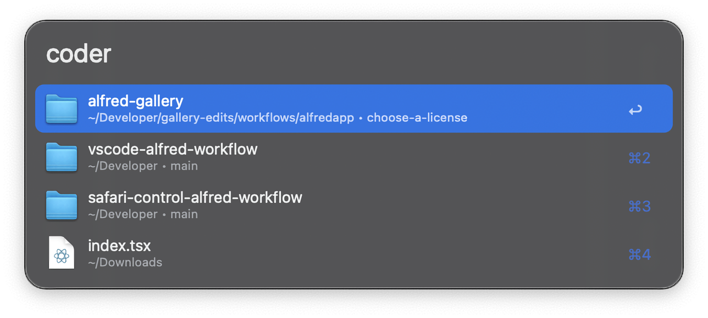
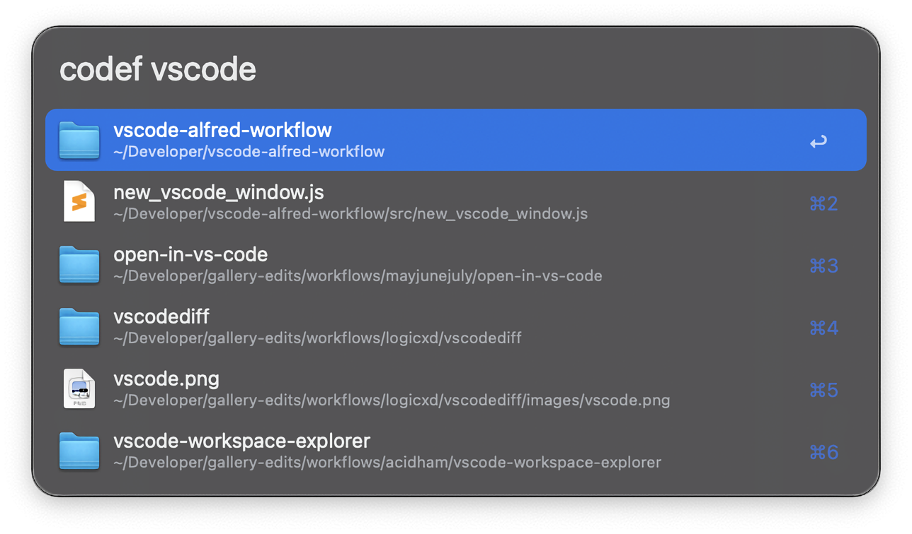
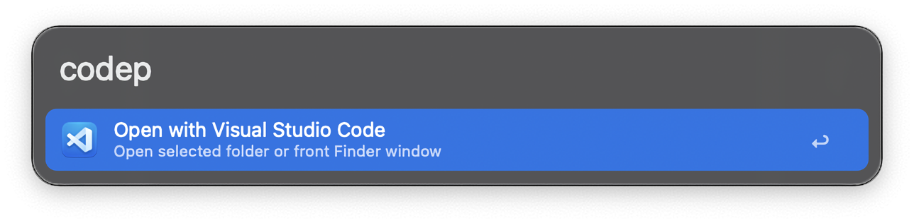
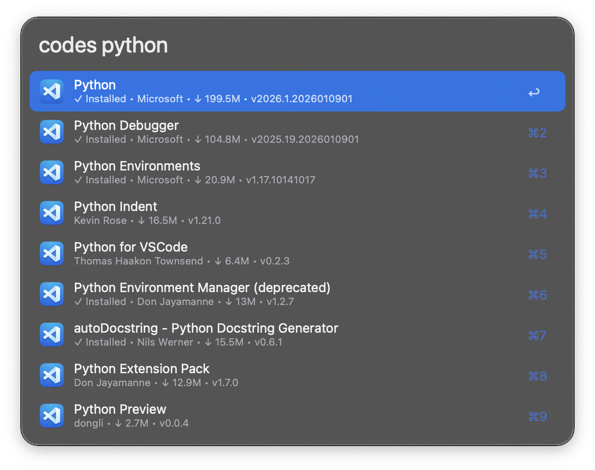
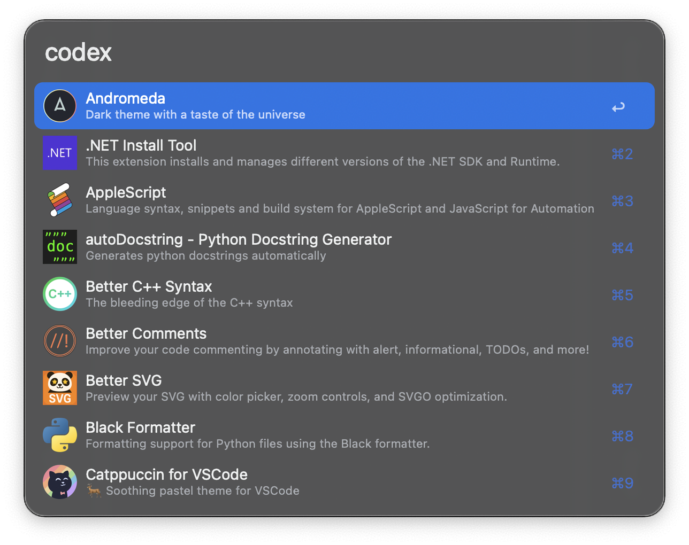

## Usage

Open a new Visual Studio Code window in your current space via the `code` keyword.

Browse your recently opened projects, workspaces, and files with the `coder` keyword.

Search for any file or folder on your Mac and open it directly in VS Code via the `codef` keyword.

Open any folder in VS Code by giving its path to the `coped` keyword. If you don't provide a path, the current selection or open Finder window will be opened.

Alternatively, open any file or folder via the Universal Action.

Search the VS Code Marketplace with the `codes` keyword.

List all your installed extensions via the `codex` keyword.

Configure the Hotkeys for faster triggering.
