## Setup

[Create an app](https://developer.spotify.com/dashboard/create) on Spotify’s developer dashboard. Pick any **App name** and **App description** you like, but ensure the **Redirect URI** is set to `http://127.0.0.1:15298/callback.php`.

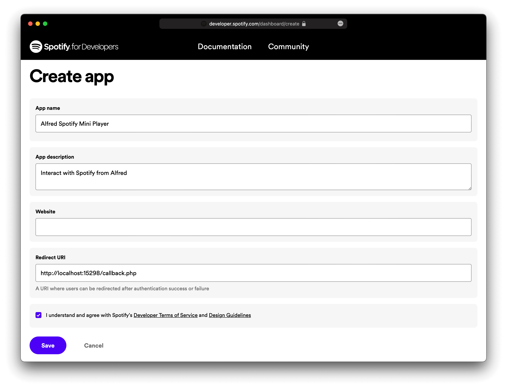

Navigate to its settings page and you’ll find a **Client ID** and **Client Secret**. They look like strings of random characters (e.g. `ce72af7d875ec3f46f6be42129c50af0`). Copy each value and set them up in the Workflow’s Configuration.

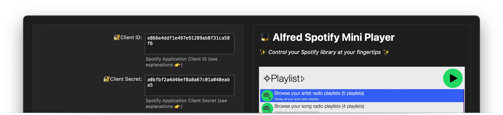

Open Alfred and use the `spot_mini` keyword to authenticate to Spotify. Your web browser will open with a page asking for confirmation.

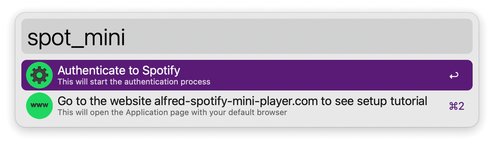

Finally, run `spot_mini` once more to create your library.

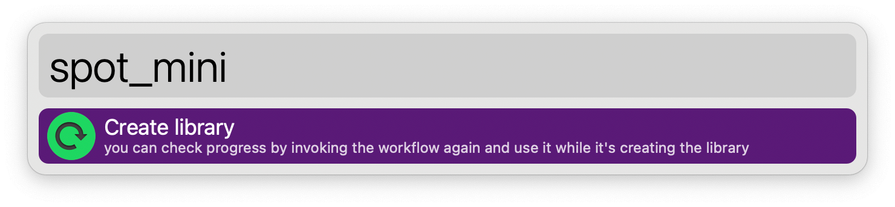

## Usage

Interact with your Spotify account via the `spot_mini` keyword. Configure the Hotkeys for faster triggering.

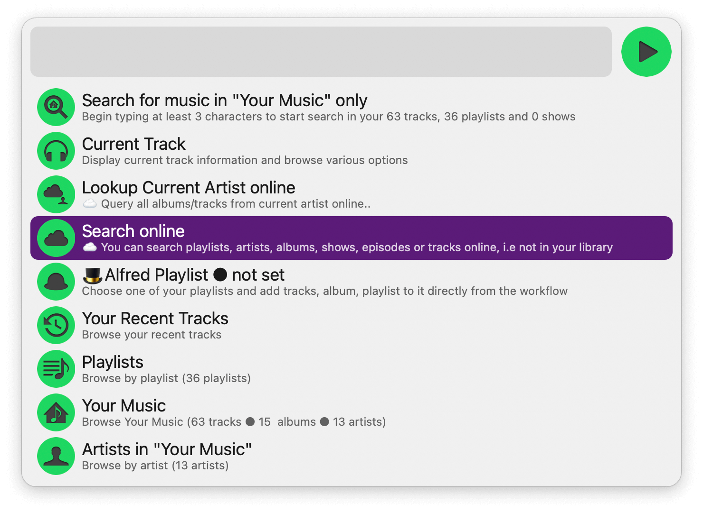

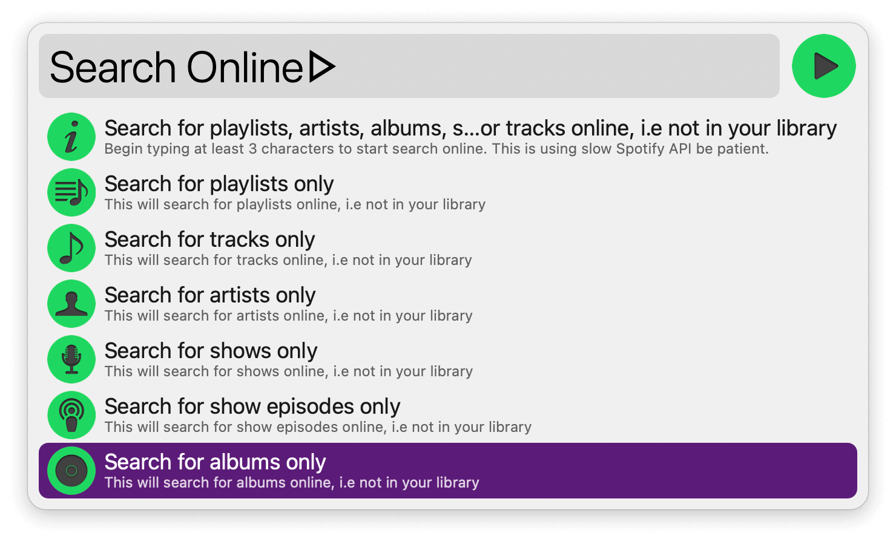

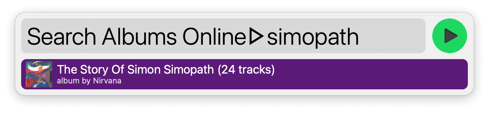

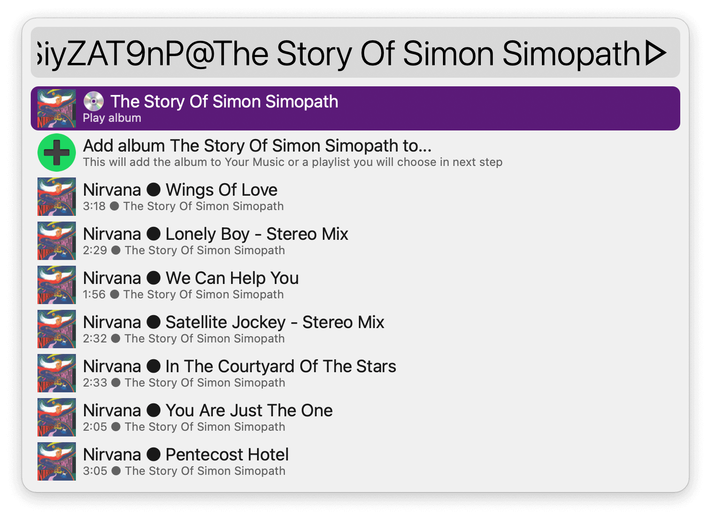

You can control playback with predictable keywords such as `play`, `pause`, `previous`, `next`, and `shuffle`.

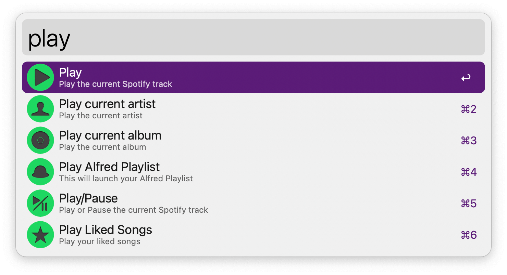

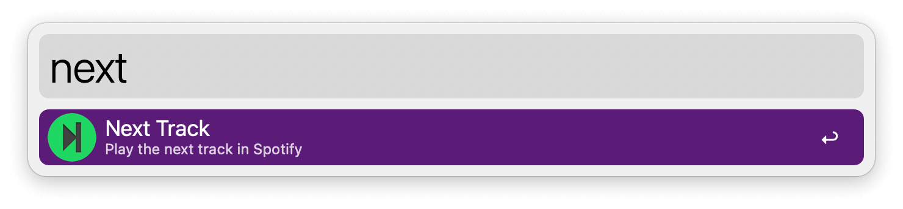

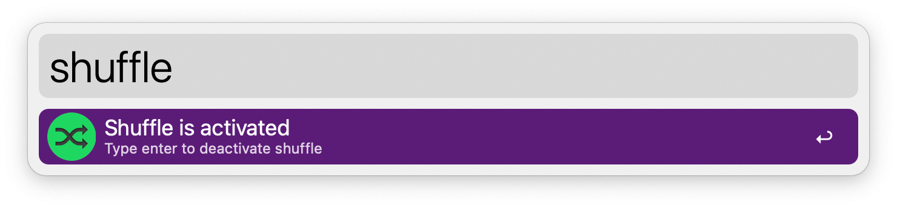

Several commands are included for [Alfred Remote](https://www.alfredapp.com/remote/).

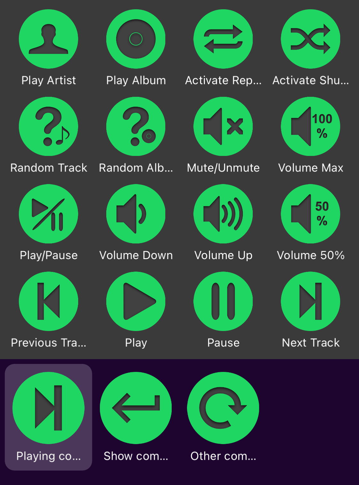
