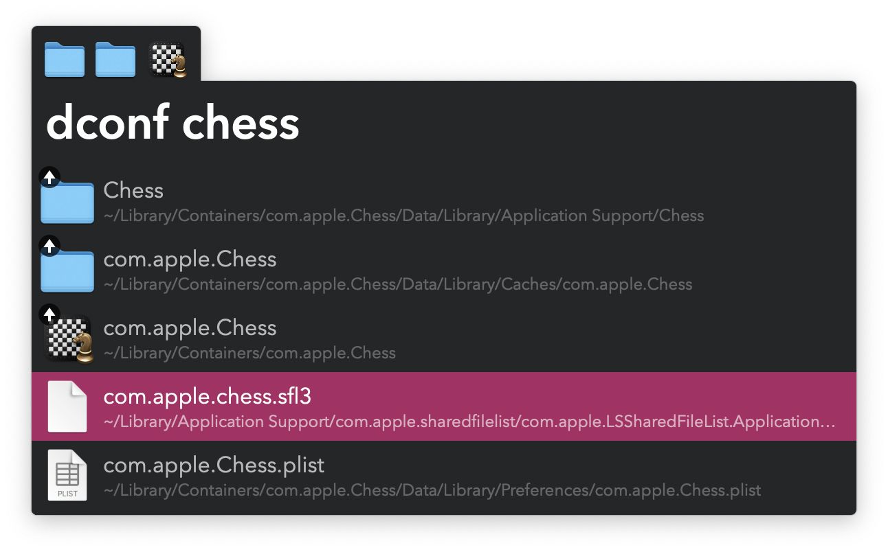

## Usage

Find files and folders in `~/Library` via the `dconf` keyword.

* <kbd>↩</kbd> Delete path.
* <kbd>⌥</kbd><kbd>↩</kbd> Ignore path during this run.
* <kbd>⇧</kbd><kbd>↩</kbd> Add path to the File Buffer.
* <kbd>⌘</kbd><kbd>↩</kbd> Trash paths in the File Buffer.
