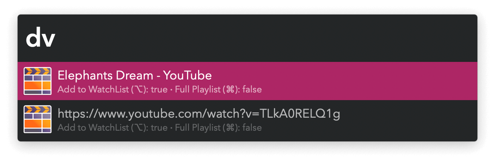
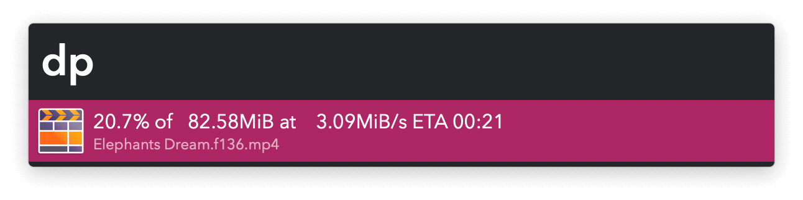

## Usage

Download video from [a plethora of online sources](https://github.com/yt-dlp/yt-dlp/blob/master/supportedsites.md) via the `dv` keyword. Download audio with `da`. Your clipboard and frontmost browser tab are checked for links.

* <kbd>↩</kbd> Download.
* <kbd>⌘</kbd><kbd>↩</kbd> Download full playlist.
* <kbd>⌥</kbd><kbd>↩</kbd> Toggle adding to [Watch List](https://alfred.app/workflows/vitor/watch-list).

Alternatively, download with the Universal Action.

Check download progress via the `dp` keyword.

* <kbd>⌘</kbd><kbd>↩</kbd> Restart download.
* <kbd>⌃</kbd><kbd>↩</kbd> Cancel.
