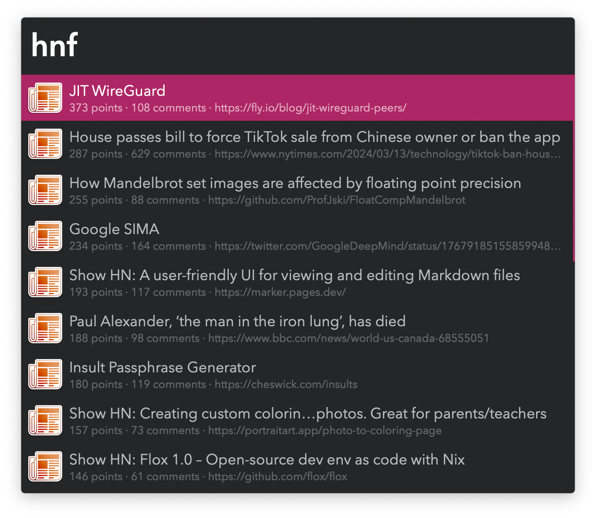
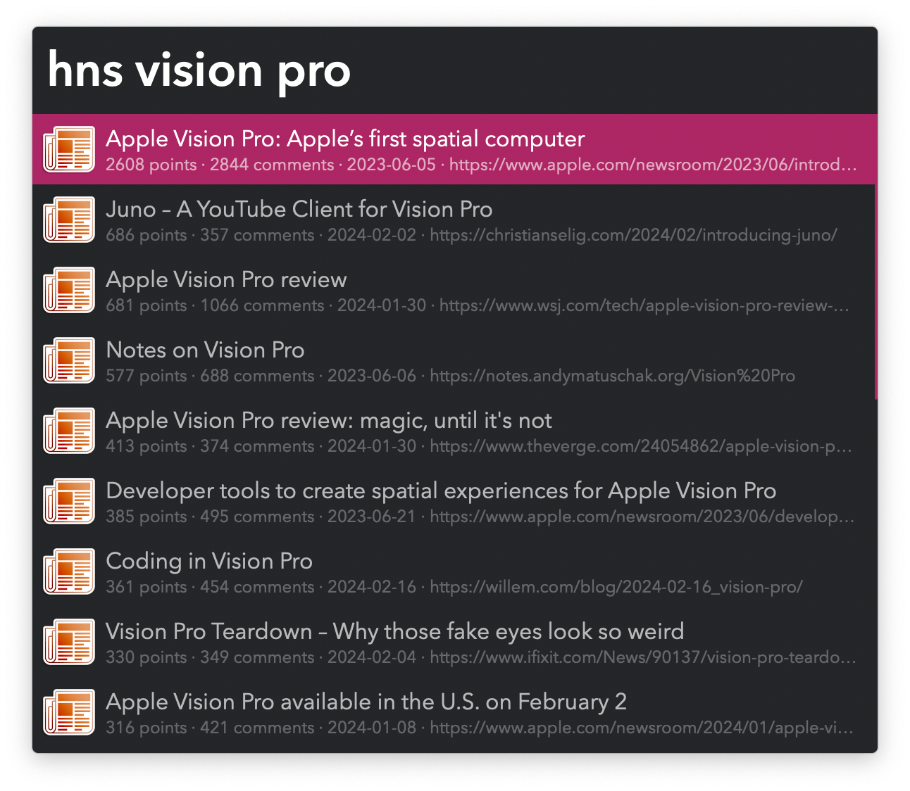

## Usage

Search the Hacker News front page via the `hnf` keyword.

Press <kbd>↩</kbd> to open the story’s website or <kbd>⌥</kbd><kbd>↩</kbd> to open the Hacker News comments thread. This behaviour can be reversed in the Workflow’s Configuration.

Seach stories with the `hns` keyword.

Previous shortcuts apply, plus <kbd>⌘</kbd><kbd>↩</kbd> switches between ordering by date (more recent first) and by relevance (then points, then number of comments).

Submit the frontmost browser tab with the `hnsubmit` keyword.

