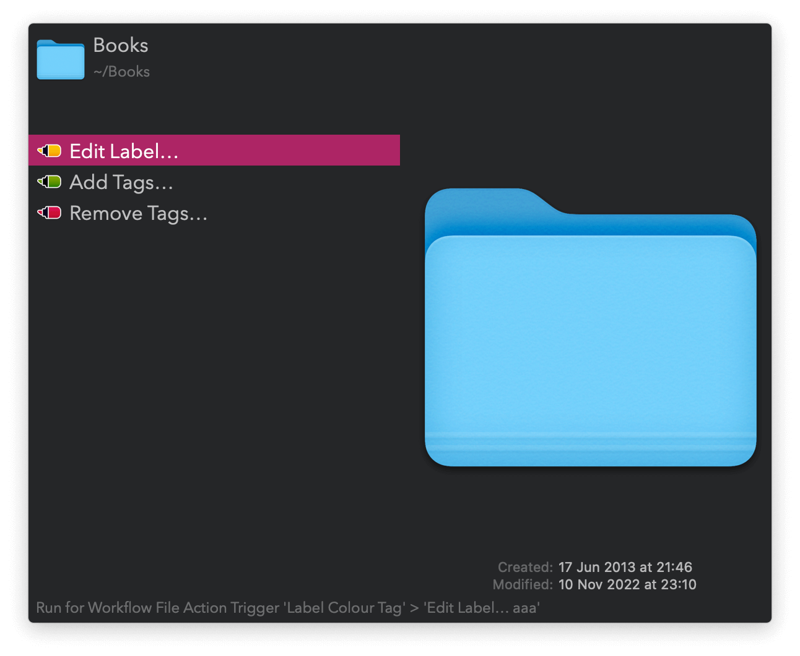
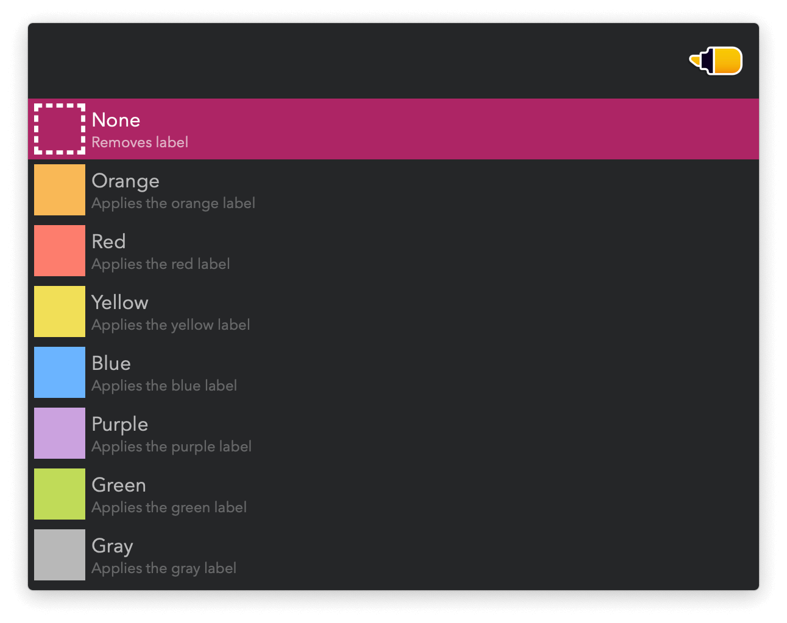
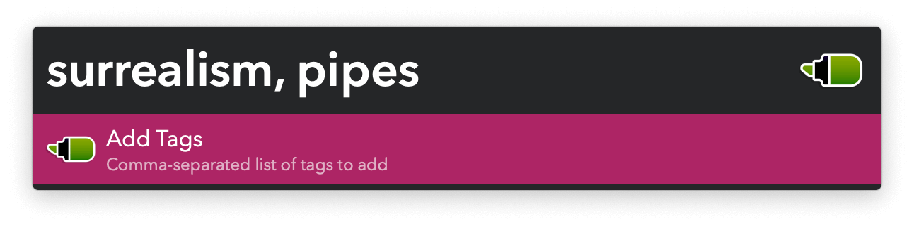
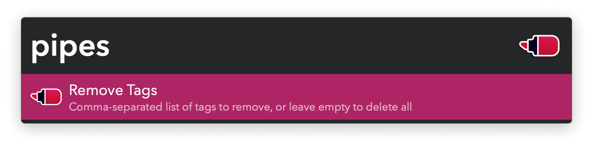

## Usage

Edit labels or add and remove tags from files and folders via the Universal Actions.

Alternatively, search for files and folders via the `label`, `tag add`, and `tag del` keywords or configure the Hotkeys.
