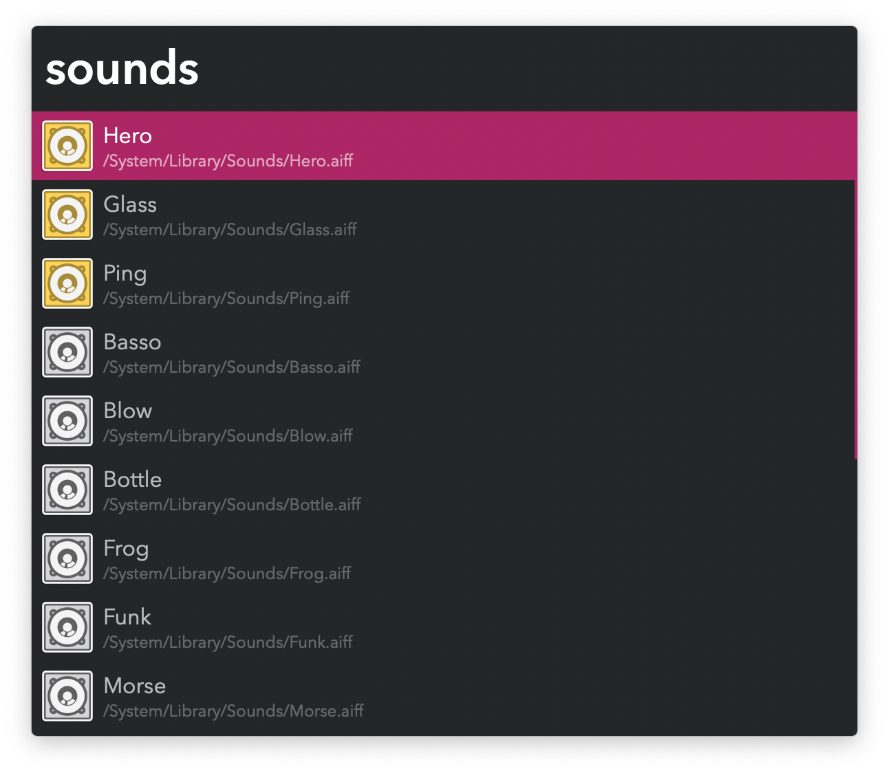

## Usage

Search sound files in `/System/Library/Sounds` and `~/Library/Sounds` via the `sounds` keyword.

* <kbd>↩</kbd> Play sound.
* <kbd>⌘</kbd><kbd>↩</kbd> Add or remove from favourites.

Favourites show up at the top of the list and can be manually ordered in the Workflow’s Configuration.
